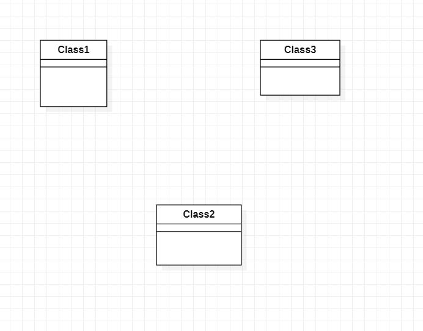

# 实验一

## 一、实验目标

1.熟悉Github实验过程

2.安装与使用StarUML

## 二、实验内容

1.安装Github并练习使用Git Bash

2.安装StarUML并建立一个图

## 三、实验步骤

1.安装Github和StarUML

2.fork主库uml-modeling-2020

3.编写md文档

4.创建用例图

5.新建学号1714080902605文件目录

6.上传用例图和md文档

7.提交到主库

## 四、实验结果

图1.在StarUML上创建的第一个图

