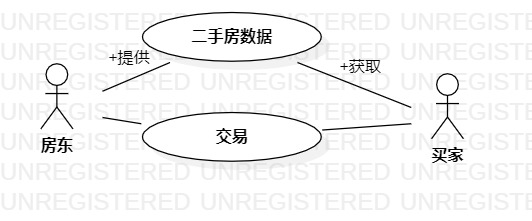

# 实验二：用例建模

## 一、实验目标

- 选题并用例建模
- 用markdown写实验报告

## 二、实验内容

- 创建系统用例图
- 编写实验报告文档

## 三、实验步骤

- 选题“二手房交易系统”
- 确定系统三个主要功能：提交房源、获取房源、订单交易
- 新建用例图，添加两个actor：房东和买家
- 添加房东use case：提交房源、获取订单
- 添加买家use case：获取房源、提交订单
- 建立关系association
- 编写系统规约

## 四、实验结果

- 确定选题为#497二手房交易系统

- 绘制系统的用例图

图1、二手房交易系统的用例图

## 表1：提交房源用例规约  

用例编号  | UC01 | 备注  
-|:-|-  
用例名称  |  提交房源 |   
前置条件  |  用户身份为房东   | *可选*   
后置条件  |     | *可选*   
基本流程  | 1. 系统显示房源填写页面；  |*用例执行成功的步骤*   
~| 2. 房东输入房源描述，点击确认按钮；  | 
~| 3. 系统检查房源描述； |
~| 4. 系统保存新增房源； |
~| 5. 系统显示房源添加成功；  |    
扩展流程  | 3.1 系统检查房源描述为空，提示按要求填写; |*用例执行失败* 

## 表2：获取房源用例规约  

用例编号  | UC02 | 备注  
-|:-|-  
用例名称  |  获取房源 |   
前置条件  |  用户身份为买家   | *可选*   
后置条件  |     | *可选*   
基本流程  | 1. 系统显示房源选择页面；  |*用例执行成功的步骤*      
~| 2. 买家点击房源选择，点击提交按钮；  |   
~| 3. 系统检查买家房源选择； |
~| 4. 系统检索房源； |
~| 5. 系统显示房源；  | 
扩展流程  | 3.1 系统检查买家无房源选择，提醒至少选择1项； |*用例执行失败* 

## 表3：提交订单用例规约  

用例编号  | UC03 | 备注  
-|:-|-  
用例名称  |  提交订单 |   
前置条件  |  用户身份为买家   | *可选*   
后置条件  |     | *可选*   
基本流程  | 1. 系统显示房源页面；  |*用例执行成功的步骤*    
~| 2. 买家点击加入订单按钮；  |   
~| 3. 系统检查房源有效；  |
~| 4. 系统显示订单页面；  |   
~| 5. 买家填写个人信息，点击确定按钮；  |
~| 6. 系统检查信息填写正确； |
~| 7. 系统保存个人信息和订单； |
~| 8. 系统显示订单提交成功；  | 
扩展流程  | 3.1 系统检查房源无效，提示该房源已过期，请重新选择； |*用例执行失败* 
~| 6.1 系统检查信息填写有误，提示按照要求填写； |

