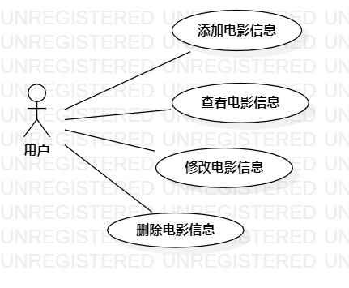

# 实验二：用例建模

## 一、实验目标

- 细化功能需求。
- 画出用例图（Use Case Diagram）。
- 编写用例规约（表格）。

## 二、实验内容

- 给每一个功能点写一段描述（字数至少60字，3行）。
- 写清楚使用功能的用户。
- 说明该功能执行之后产生的结果。
- 用例规约必填：基本流程（成功执行用例的步骤）；扩展流程（引起用例失败的步骤）。

## 三、实验步骤

- 确定系统内容
- 在StarUML绘制用例图
- 将ACTOR和USE CASE拉入画板
- 用Association连接形成关系

## 四、实验结果

图1、影迷之家的用例图

