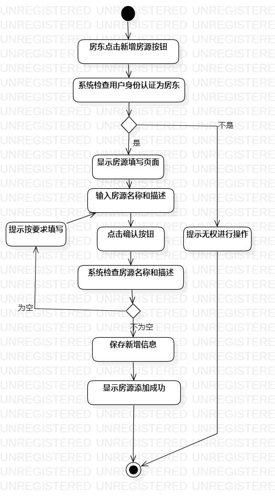
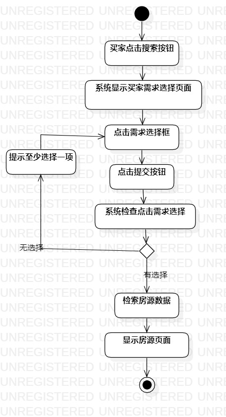
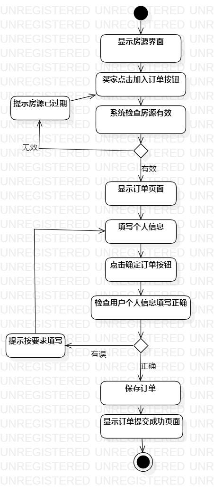

# 实验三：过程建模

## 一、实验目标

1. 掌握过程建模的方法
2. 学会绘制活动图

## 二、实验内容

1. 在StarUML绘制活动图（Activity Diagram）

## 三、实验步骤

1. 新建一个Activity Diagram
- 命名为“提交房源活动图”
- 添加inital和final
- 根据系统用例添加action
- 如果有判断过程，添加decision
- 用control flow连接inital、action、final、decision

2. 新建其余两个Activity Diagram，分别命名“获取房源活动图”和“提交订单活动图”
- 具体过程如上

## 四、实验结果

- 绘制活动图如下

图1、提交房源活动图

图2、获取房源活动图

图3、提交订单活动图
