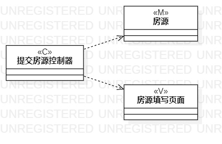
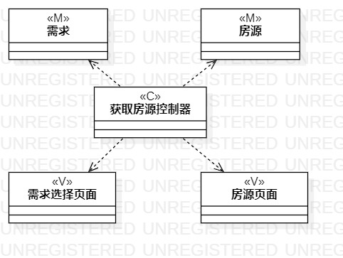
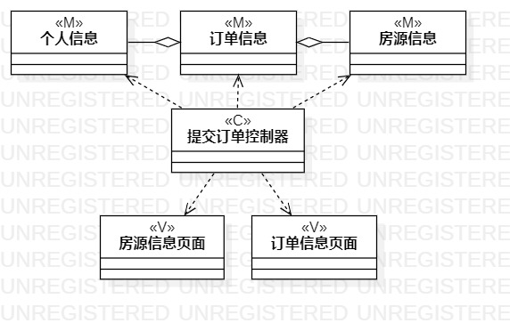

# 实验四：类建模
# 实验五：高级类建模

## 一、实验目标
1. 掌握类建模的方法
2. 学习MVC设计模式
3. 掌握类图的画法

## 二、实验内容
1. 根据MVC模式设计类和类的关系
2. 画类图

## 三、实验步骤

1. 查看实验二的用例规约，找到每个用例规约的数据、界面、控制器
2. 新建类图，命名为“提交房源类图”，添加类
3. 使用Dependency连接类
4. 新建“获取房源类图”和“提交订单类图”
5. 添加类并使用Dependency和Aggregation连接类

## 四、实验结果

图1、提交房源类图

图2、获取房源类图

图3、提交订单类图

## 五、实验总结

本次实验学习了MVC模式设计和类的五种关系。M（Model）包括模型、实体、数据，V（View）包括视图、界面、AbcUI，C（Control）包括控制器、系统、Controller、Service。类的五种关系（Relationships）分别是Dependency、Association、Aggregation、Composition、Inheritance，关系强度由弱到强递增。
