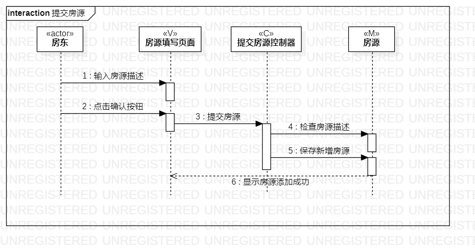
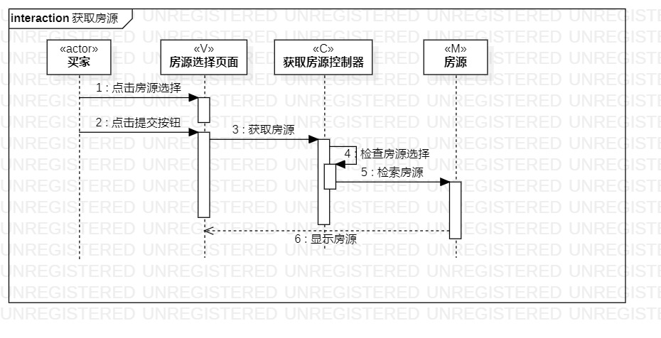
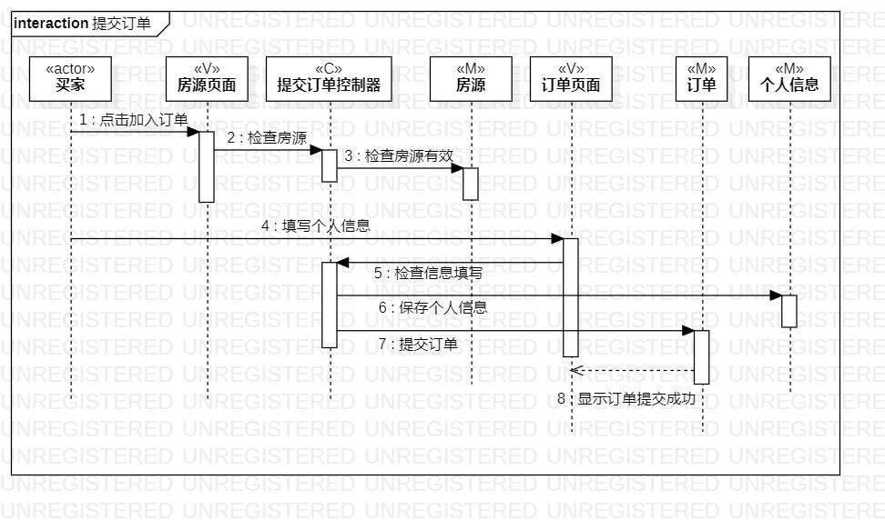

# 实验六：交互建模

## 一、实验目标

1. 理解系统交互
2. 学会UML顺序图的画法

## 二、实验内容

1. 根据用例模型和类模型，确定功能所涉及的对象
2. 画参与者（对象）
3. 画消息（交互）

## 三、实验步骤

1. 从实验二的用例图中找到主要参与者
2. 从实验室四的类图中找到其他参与者
3. 新建顺序图
4. 添加lifeline，根据参与者命名
5. 从实验三的活动图找到交互
6. 用message表示参与者的交互情况

## 四、实验结果

图1、提交房源顺序图

图2、获取房源顺序图

图3、提交订单顺序图
