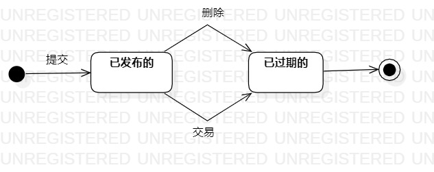

# 实验七：状态建模

## 一、实验目标

1. 掌握对象状态建模
2. 画状态图

## 二、实验内容

1. 根据用例图、活动图等确定关键对象
2. 确定对象的状态和状态的转换条件
3. 画系统对象的状态图

## 三、实验步骤

1. 从用例图、活动图等找到关键对象
2. 新建状态图，添加Initial State 和 Final State
3. 添加状态的Simple State
4. 用Transition连接，写上转换条件

## 四、实验结果

图1、房源的状态图
