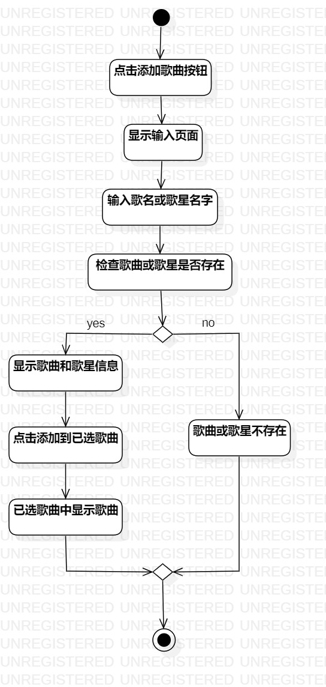
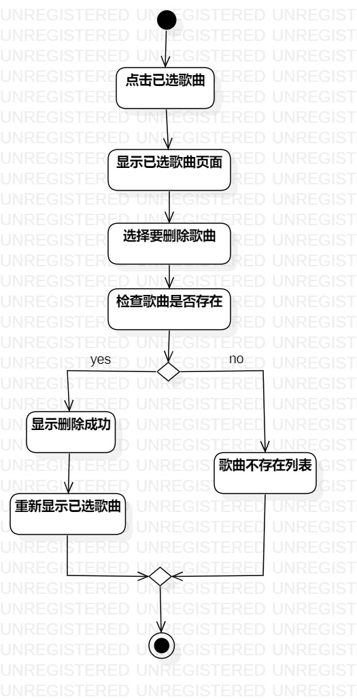

# 实验三：过程建模

##一、实验目标

1. 掌握过程建模方法。
2. 掌握活动图的画法。（Activity Diagram）

##二、实验内容

1. 根据用例规约画出活动图。
2. 完善活动图并编写实验报告

##三、实验步骤

1. 添加开始结点Initial和结束结点Final。
2. 根据用例规约的基本流程添加Action
3. 扩展流程在对应位置添加相应的Decision
4. 补充完后续Action。
5. 添加Merge合并分支。
6. Control flow连接各个部分。
7. 多个用例规约重复上述步骤。

##四、实验结果

图1：新增歌曲的活动图

图2：删除歌曲的活动图
