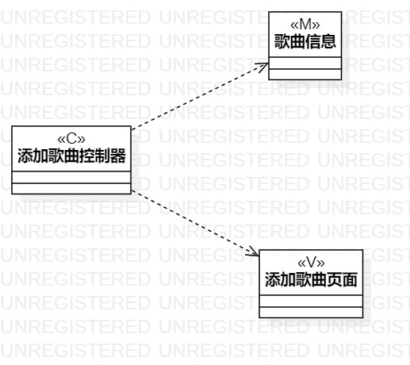
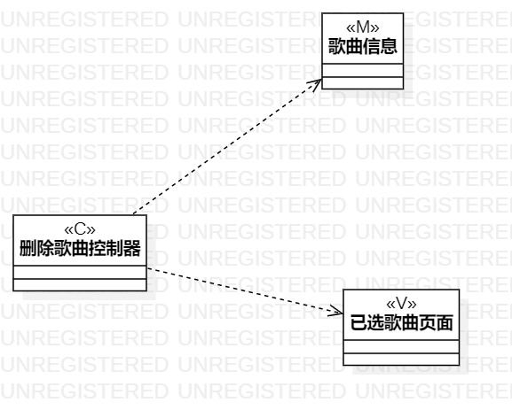

#实验四&五 类建模

##一、实验目标

1. 掌握类建模方法
2. 了解MVC模式
3. 掌握类图画法（Class Diagram）
4. 理解UML的五种关系

##二、实验内容

1. 根据用例规约画出类图

##三、实验步骤

1. 根据MVC模式创建用例的类图
2. 根据规约中需求添加类(Class)
3. 确定各个(类)Class的依赖(Dependency)
4. 确定类之间的聚合(Aggregation)关系

##四、实验结果

图1. 新增歌曲的类图

图2. 删除歌曲的类图
