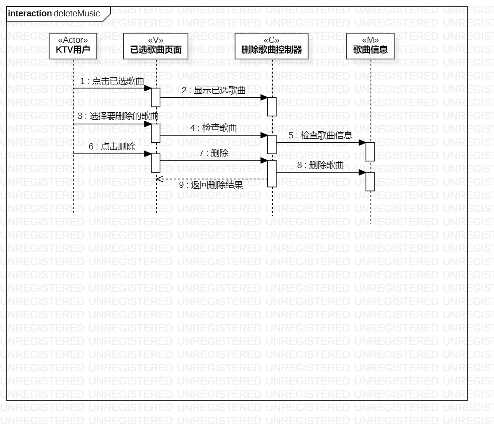

#实验四&五 类建模

##一、实验目标

1. 掌握交互建模方法
2. 了解顺序图（SequenceDiagram）的画法

##二、实验内容

1. 根据用例图、类图、活动图画出顺序图

##三、实验步骤

1. 从用例图找到第一个参与者（Actor）
2. 从类图中找到n个参与者，总共n+1个参与者
3. 从活动图中找到操作步骤，画出参与者之间的消息

##四、实验结果

图1. 新增歌曲的顺序图

图2. 删除歌曲的顺序图
