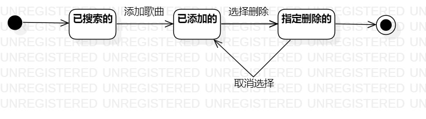

# 实验七：状态建模

## 一、实验目标
    1. 掌握对象状态建模方法
    2. 画出状态图

## 二、实验内容
    1. 根据用例图、用例规约、活动图、类图、顺序图来画出状态图；
    2. 找出该对象的关键状态及状态之间的转变条件。
    
## 三、实验步骤
     1. 找出系统一个重要对象——歌曲；
     2. 找出这个对象的所有重要的状态；
     3. 画出状态之间的转换条件；

## 四、实验结果

图1. 状态图
