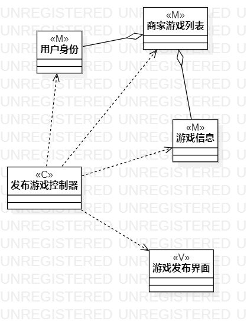
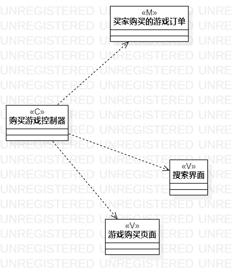

# 实验四和五：类建模

## 一、实验目标

1.掌握类建模方法；
2.了解MVC或你熟悉的设计模式；
3.掌握类图的画法。（Class Diagram）

## 二、实验内容

1.基于MVC模式设计类；
2.设计类的关系；
3.画出类图。

## 三、实验步骤

1. 创建命名为 发布/购买游戏 的类图
2. 根据用例规约添加controller、model和view类
3. 把类用dependency和aggregation根据关系连接起来
4. 导出图片

## 实验结果

  
图1：发布游戏的类图

  
图2：购买游戏的类图
