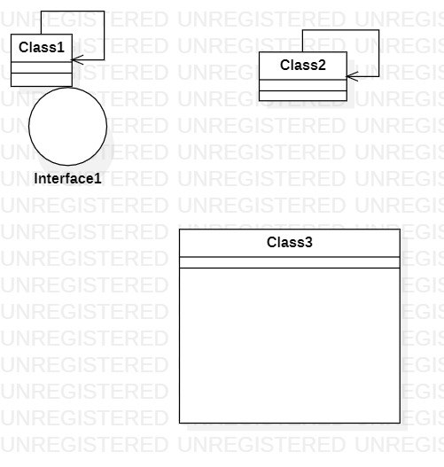

# 实验一

## 一、实验目标

1.熟悉GitHub的实验过程  
2.安装与使用StartUML  

## 二、实验内容

1.安装GitHub并练习使用Git Bash  
2.安装StartUML并创建一个图  

## 三、实验步骤

1. 打开StarUML软件随意画一个图
2. 将所画的图以.jpg的格式保存到学号文件夹
3. 在自己的student文件下用git bash将图片上传到github个人库中
4. 并完善lab1.md  

## 四、实验结果

1.画图

  
图1.在StartUML里创建的第一个图
