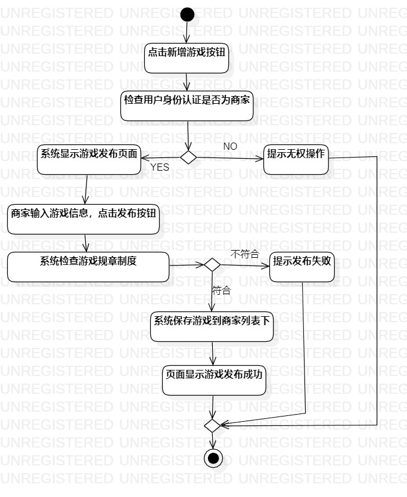
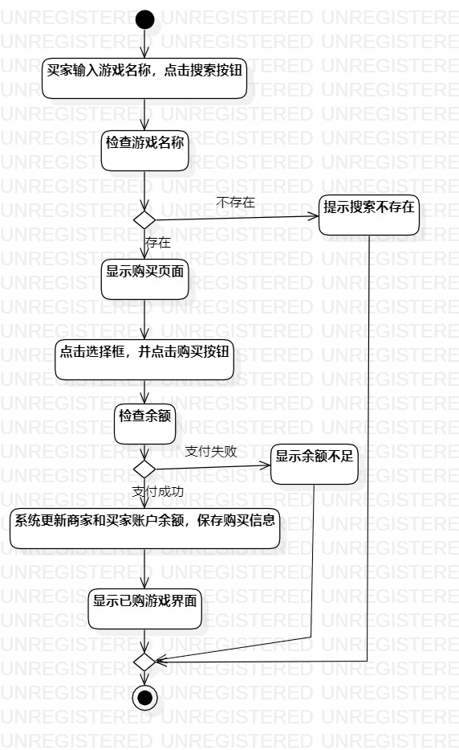

# 实验三：过程建模

## 一、实验目标

1. 掌握过程建模方法
2. 掌握活动图的画法（Activity Diagram）

## 二、实验内容

1. 根据实验二中的用例规约步骤创建活动图

## 三、实验步骤

1. 创建命名为 发布游戏/购买游戏 的活动图
2. 添加开始和结束标志的initial和final
3. 根据用例规约添加多个action
4. 对扩展流程的判断添加decision
5. 最后连接起来，Merge合并
6. 检查活动图是否符合用例规约不足，并可以适当缩减步骤名称

## 实验结果

  
图1：发布游戏的活动图

  
图2：购买游戏的活动图
