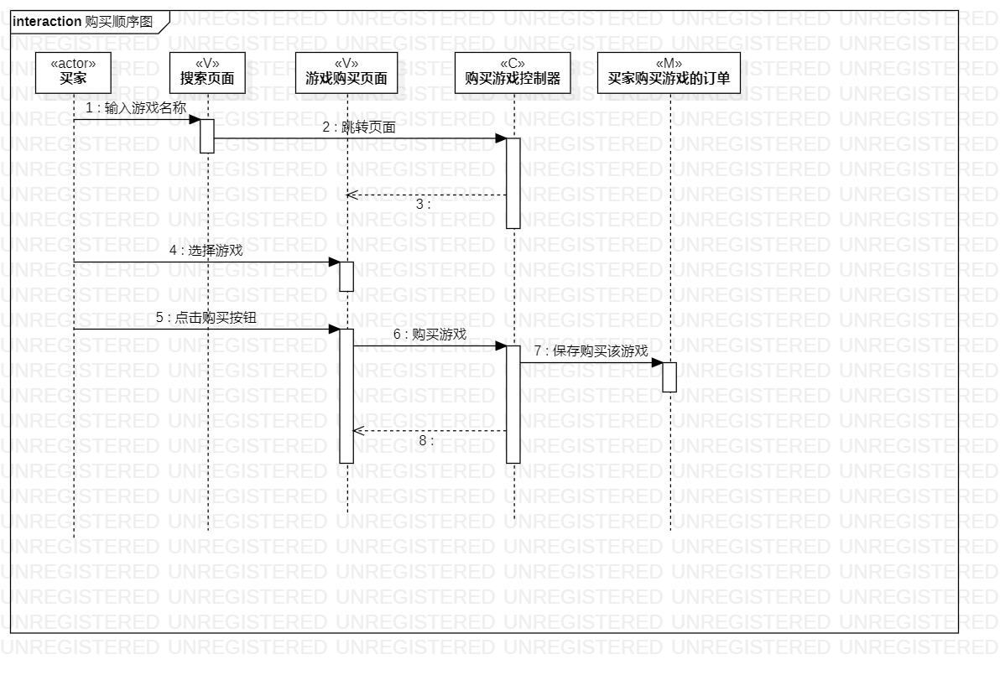

# 实验六：交互建模

## 一、实验目标

1.理解系统交互；  
2.掌握UML顺序图的画法；  
3.掌握对象交互的定义与建模方法。  

## 二、实验内容

1.根据用例模型和类模型，确定功能所涉及的系统对象；  
2.在顺序图上画出参与者（对象）；  
3.在顺序图上画出消息（交互）。  

## 三、实验步骤

1. 创建命名为 发布/购买游戏 的顺序图；  
2. 根据用例规约、活动图和类图确定参与者、控制器、视图和数据；  
3. 根据用例规约把步骤联系起来，用Message和rely message箭头导向和描述动作；  
4. 在确定是否使用self message；  
5. 导出图片，并上传到github；  

## 实验结果

  
图1：发布游戏的类图

  
图2：购买游戏的类图
