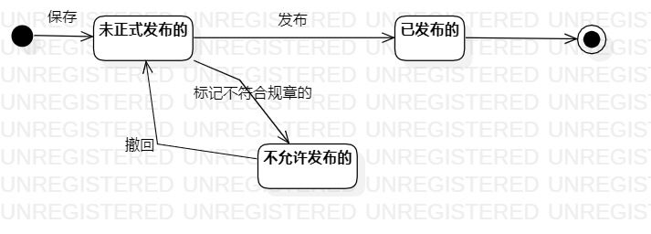

# 实验七：状态建模

## 一、实验目标

1.掌握对象状态建模（状态图，Statechart）。  

## 二、实验内容

1.根据活动图、顺序图、MVC图、用例规约画状态图。  

## 三、实验步骤

1. 找出对象  
2. 画出对象的状态图  

## 四、实验要点  

1. 寻找一个关键的对象；  
2. 设计该对象的关键状态；  
   对象的状态是：对象所表示的数据。如果数据发生变化，状态就是发生变化。  
   描述状态：形容词。  
   订单： 新的（New）、已付款的、取消的、已发货的、已签收的、退货中的、 完成的。  
3. 设计状态之间的转变条件。  
   
## 实验结果

  
图1：游戏的状态图

