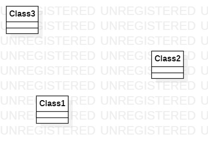

# 实验一

## 一、实验目标

1.熟悉GitHub实验过程
2.安装与使用StarUML

## 二、实验内容

1.安装GitHub并练习使用Git Base
2.安装StarUML并创建一个图

## 三、实验过程

1.创建文档并传到GitHub上
2.创建uml图并传到GitHub上
3.写文档
4.提交

## 四、实验结果

1、将uml图显示到GitHub上面

  
图1、在StarUML上创建的第一个图

