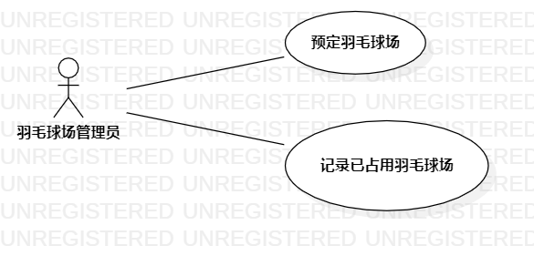

# 实验二：用例建模

## 1.实验目标

1.细化功能需求。  

2.画出用例图（Use Case Diagram）。  

3.编写用例规约。  

## 2.实验内容

1.给每一个功能点写一段描述（字数至少60字，3行）。  

2.写清楚使用功能的用户。  

3.说明该功能执行之后产生的结果。  

4.用例规约必填：基本流程（成功执行用例的步骤）；扩展流程（引起用例失败的步骤）。  

## 3.实验步骤

1.确定选题-羽毛球场管理系统  
  功能:1.1 可以预定羽毛球场  
       1.2 记录羽毛球场是否被占用  
       
2.根据选题，创建用例图  

3.创建羽毛球场管理员与两个用例  

4.建立羽毛球场管理员与用例图之间的关系  

5.编写用例规约  

## 4.实验结果

1. 画图  
  
图二 羽毛球场管理系统用例图

2.用例规约：

## 表1：预定羽毛球场用例规约  

用例编号  | u01 | 备注  
-|:-|-  
用例名称  | 预定羽毛球场  |   
前置条件  | 羽毛球场管理员登录系统    | *可选*   
后置条件  |      | *可选*   
基本流程  | 1. 羽毛球场管理员点击预定按钮；  |*用例执行成功的步骤*    
~| 2. 选择时间和场地号码，点击确认按钮；  |   
~| 3. 系统查询此时间段羽毛球场为空闲，将羽毛球场状态修改为占用状态并保存；  |   
~| 4. 界面提示预定成功； |   
~| 5.    |  
扩展流程  | 3.1 系统检查发现羽毛球场管理员预定的羽毛球场已经被占用，**提示“场地已被占用”**；  |*用例执行失败*    
~|  |  

## 表2：记录羽毛球场为空状态用例规约  

用例编号  | u02 | 备注  
-|:-|-  
用例名称  | 记录羽毛球场为空状态  |   
前置条件  | 羽毛球场管理员登录系统    | *可选*   
后置条件  |      | *可选*   
基本流程  | 1. 选择羽毛球场号码，点击羽毛球场的状态栏，选择为空状态 |*用例执行成功的步骤*    
~| 2. 系统查询此时间段羽毛球场为占用状态，修改羽毛球场状态为空并保存；  |   
~| 3. 提示修改羽毛球场状态成功 |   
~| 4.   |   
~| 5.   |  
扩展流程  | 2.1 系统发现保存的羽毛球场已经为空，**提示“羽毛球场为空，请确认选择羽毛球场是否为对的”**；  |*用例执行失败*    
~|  |  

