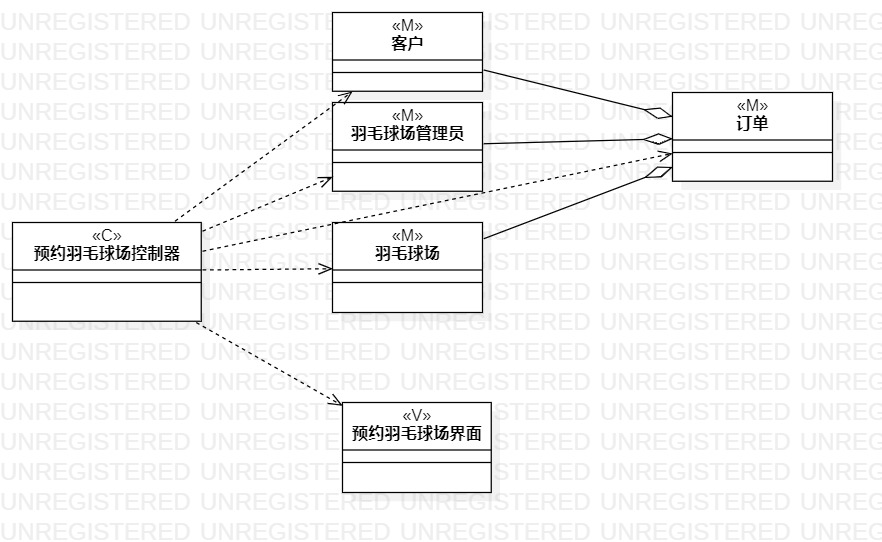
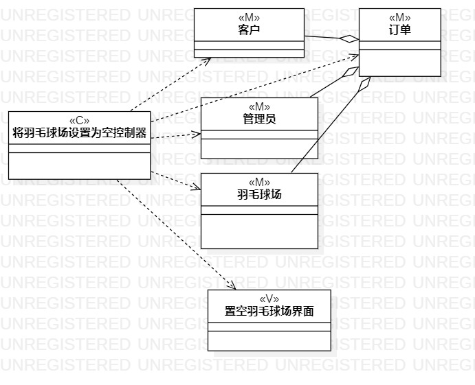

# 实验四、五

## 一、实验目标

1. 掌握类建模方法
2. 了解MVC设计模式
3. 理解类的5种关系
4. 掌握类图(Class Diagram)的画法

## 二、实验内容

1. 观看教学视频，学习类建模知识
2. 基于MVC模式设计类
3. 设计类的关系
4. 根据类的关系画出类图

## 三、实验步骤

1.创建预约羽毛球场的类图；
2.创建预约羽毛球场控制器，羽毛球场管理员，羽毛球场，预约羽毛球场界面等4个类；
3.将类用依赖线和聚合线连接
4.创建将羽毛球场设置为空的类图；
5.创建将羽毛球场设置为空控制器，羽毛球场管理员，羽毛球场，置空羽毛球场界面等4个类；
6.将类用依赖线和聚合线连接

## 实验结果 
  
  
图1：预约羽毛球场的类图  
  
  
图2：将羽毛球场设置为空的类图  

