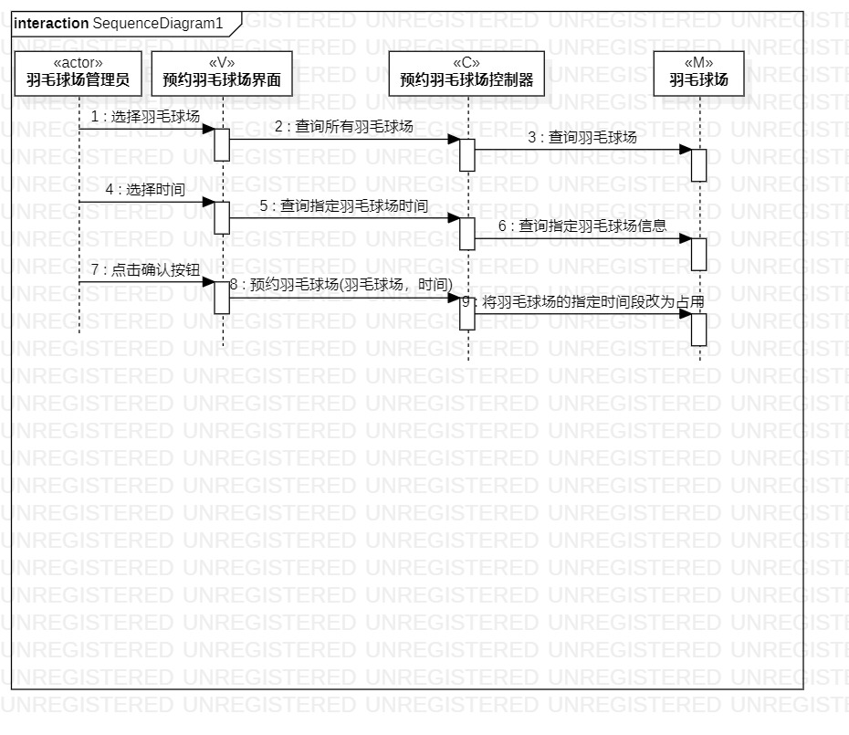
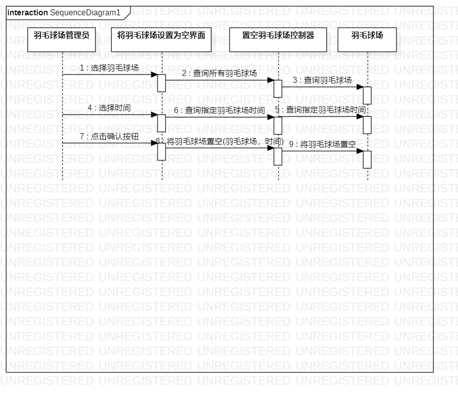

# 实验六: 交互建模
## 一、实验目标
- 理解系统交互；
- 了解对象的概念
- 掌握UML顺序图的画法；
- 掌握对象交互的定义与建模方法。
## 二、实验内容
1. 根据用例模型和类模型，确定功能所涉及的系统对象；
2. 在顺序图上画出参与者（对象）  
3. 在顺序图上画出消息（交互） 
## 三、实验步骤
  1.修改实验4的图  
  2.根据用例模型的参与者和类模型设计的类确定顺序图的参与者  
  3.根据活动图确定参与者之间的关系  
## 四、实验结果

图1 预约羽毛球场顺序图

图2 将羽毛球场设置为空顺序图
