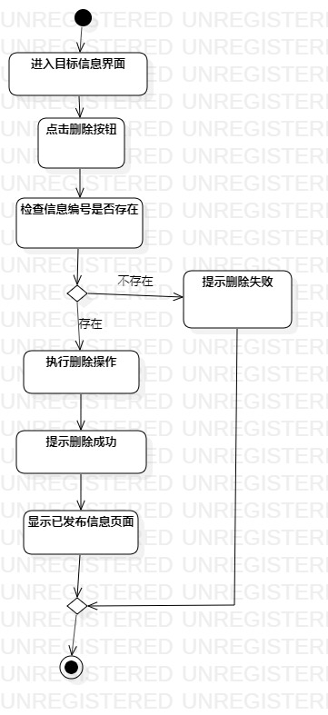
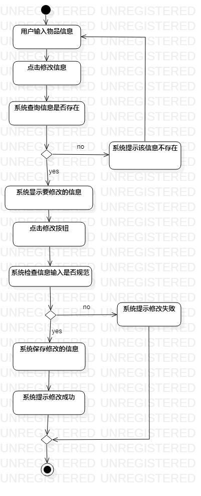

# 实验三:过程建模

## 一、实验目标

1. 学习并掌握过程建模  
2. 掌握活动图的绘制  

## 二、实验内容

1. 学习过程建模
2. 根据用例规约绘制自己系统的活动图  

## 三、实验步骤
1. 在StarUML上创建校园寻物启事系统的活动图  
  - 发布活动图  
  - 删除活动图  
  - 修改活动图    
2. 先添加Initial节点表示活动图的开始  
3. 再根据自己实验二所做的用例规约添加相应的Action和Decision节点  
4. 添加Final节点作为活动图的结束  
5. 用Control Flow各个节点连接起来成为一份完整的活动图  

## 四、实验结果

  
图1. 发布寻物信息活动图  

  
图2. 删除寻无信息活动图  

  
图3. 修改寻无信息活动图  
