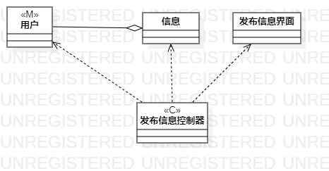
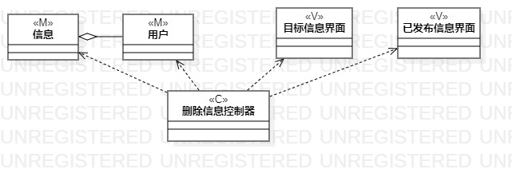
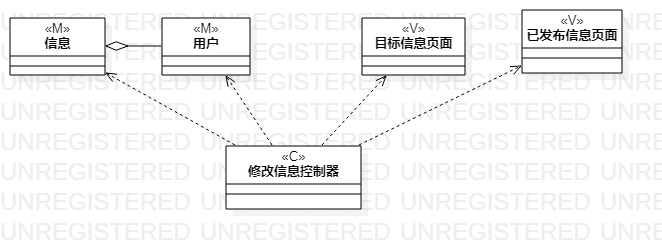

# 实验四、五

## 一、实验目标

1. 掌握类建模方法
2. 了解MVC设计模式
3. 理解类的5种关系
4. 掌握类图(Class Diagram)的画法

## 二、实验内容

1. 观看教学视频，学习类建模知识
2. 基于MVC模式设计类
3. 设计类的关系
4. 根据类的关系画出类图

## 三、实验步骤

1. 修改实验二的用例规约
2. 修改实验三的过程图
3. 观看和学习类建模知识
4. 从修改好的用例规约中的基本流程和扩展流程中寻找类
5. 根据 发布寻物信息 的用例规约设计：
	- M：寻物信息的编号的内容（信息类）、用户的账号和密码（用户类）
	- V：发布寻物信息的界面、展示寻物信息的首页界面
	- C：发布寻物信息的控制器
6. 根据 删除寻物信息 的用例规约设计：
	- M：寻物信息的编号的内容（信息类）、用户的账号和密码（用户类）
	- V：删除的目标寻物信息的界面、展示已发布的所有寻物信息的界面
	- C：删除寻物信息的控制器
7. 根据 修改寻物信息 的用例规约设计：
	- M：寻物信息的编号的内容（信息类）、用户的账号和密码（用户类）
	- V：修改寻物信息的界面、展示已发布的所有寻物信息的界面
	- C：修改寻物信息的控制器

## 四、实验结果
1. 画图  

  
图1. 发布寻物信息的类图  
  
  
图2. 删除寻物信息的类图  
  
  
图3. 修改寻物信息的类图
