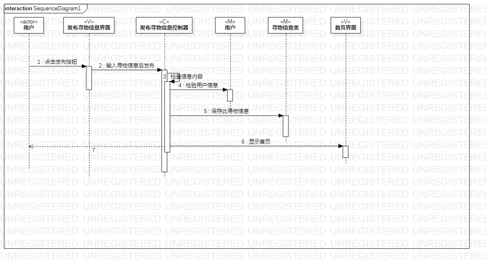
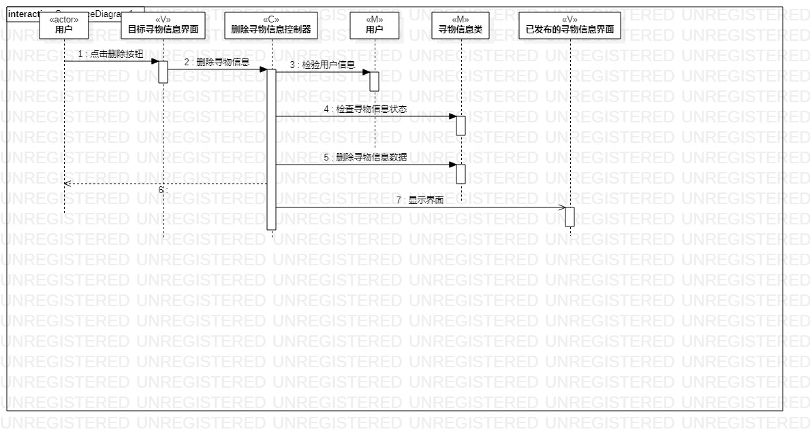

# 实验六

## 一、实验目标

1. 理解系统交互
2. 掌握UML顺序图的画法
3. 理解对象交互的定义与建模方法

## 二、实验内容

1. 观看教学视频，学习交互建模知识
2. 根据用例模型和类模型，确定功能所涉及的系统对象
3. 在顺序图上画出参与者（对象）
4. 在顺序图上画出消息（交互）

## 三、实验步骤

1. 观看和学习交互建模知识
2. 根据用例模型和类模型，确定功能所涉及的系统对象
3. 根据 发布寻物信息 的用例规约设计：
	- 参与者(actor)：用户
	- M：寻物信息的内容（寻物信息类）、用户的账号和密码（用户类）
	- V：发布寻物信息的界面、展示寻物信息的首页界面
	- C：发布寻物信息的控制器
	- 消息(message)：发布寻物信息-用例规约里的步骤
4. 根据 删除寻物信息 的用例规约设计：
	- 参与者(actor)：用户
	- M：寻物信息的编号的内容（寻物信息类）、用户的账号和密码（用户类）
	- V：删除的目标寻物信息的界面、展示已发布的所有寻物信息的界面
	- C：删除寻物信息的控制器
	- 消息(message)：删除寻物信息-用例规约里的步骤

## 四、实验结果
1. 画图  

  
图1. 发布寻物信息的顺序图  
  
  
图2. 删除寻物信息的顺序图  
  
