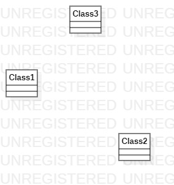

# 实验一

## 一、实验目标

1. 熟悉GitHub实验过程
2. 安装与使用StarUML

## 二、实验内容

1. 安装GitHub并练习使用Git Bash
2. 安装StarUML并创建一个图

## 三、实验步骤

1. 登录GitHub账号，打开老师实验库
2. 在老师实验库下点击fork将项目复制到个人库下
3. 安装Git工具后打开Git Bash分别用cd命令和clone命令将个人库的的代码克隆到本地的磁盘
4. 创建一个以自己学号命名的文件夹
5. 用网页编辑工具创建一个Markdown文件保存在自己创建的文件夹里
6. 采用相应的指令如git push将个人磁盘里的内容提交到个人实验库
7. 在个人实验库点击New pull request按钮发送合并请求给老师实验库
8. 检查自己修改过的文件有没有改错文件
9. 等待老师批阅

## 四、实验结果

1. 画图

  
图1. 在StarUML上创建的第一个图
