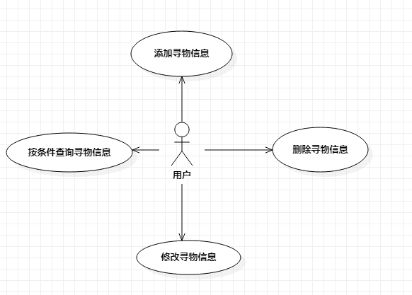

# 实验二：用例建模

## 一、实验目标

1. 对实验一的操作进行复习
2. 熟悉Markdown的各种语法

## 二、实验内容

1. 在StarUML上画一个图
2. 编写好一个完整的Markdown文档

## 三、实验步骤

1. 进行选题
2. 在StarUML上画一个关于自己选题的用例图
3. 把图片保存到以自己命名的学号文件夹下
4. 创建一个实验二的md文档
5. 把磁盘里的文件推送到个人实验库上
6. 在个人实验库上打开实验二md文档进行Markdown编辑成一个完整的实验文档
7. 在个人实验库点击New pull request按钮发送合并请求给老师实验库
8. 检查自己修改过的文件有没有改错文件
9. 等待老师批阅

## 四、实验结果

1. 画图

  
图2. 第二个StarUML图
