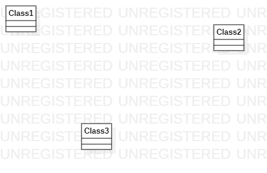

# 实验一

## 一、实验目的

1.熟悉GitHub实验过程  
2.安装与使用StarUML

## 二、实验内容

1.安装GitHub并练习使用Git Bash  
2.安装StarUML并创建一个图  

## 三、实验步骤

1.下载百度网盘上的压缩包，然后安装  
2.在StarUML上面使用工具画个图，然后保存为jpg格式，命名为model1，放在自己的文件夹那里  
3.然后用Git Bash按照发送步骤将图片推送到Github中  
4.在建模文档中使用所提交的图片完成实验报告

## 四、实验结果

1.画图  
  
图1.在StarUML上创建的第一个图  
