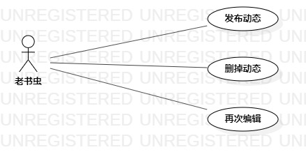

# 实验二：用例建模

## 一、实验目标
 
1、在Issues上发布个人选题    
2、学习用例建模    

## 二、实验内容

1、选择个人建模选题，发在Issues上  
2、学习用例建模的基本概念  
3、画用例图  
4、编写用例规约

## 三、实验步骤

1、选题：小书亭之个人动态系统  

2、功能确认：  
- 发布动态  
- 删掉动态  
- 再次编辑  

3、在StarUML上画图：    
- actor：老书虫
- use case：发布动态、删掉动态、再次编辑  
- 根据相关关系连线    

4、编写用例规约

## 四、实验结果

  
图1.小书亭之个人动态系统的用例图

## 用例规约的编写

## 表1：发布动态用例规约  

用例编号  | UC01 | 备注  
-|:-|-  
用例名称  | 发布动态  |   
前置条件  | 书虫进入个人动态页面    | *可选*   
后置条件  | 系统显示个人动态发布成功     | *可选*   
基本流程  | 1.书虫点击发布动态按钮  |*用例执行成功的步骤*    
~| 2.系统显示编辑信息页面 |   
~| 3.书虫填写想发布的信息  |
~| 4.书虫点击发布按钮  |
~| 5.系统检查发布内容不能为空  |   
~| 6.系统保存个人动态信息  |
~| 7.系统显示信息发布成功  |  
扩展流程  | 5.1系统检查发布内容为空，提示：“发布内容不可为空”  |*用例执行失败*    

## 表2：删掉动态用例规约  

用例编号  | UC02 | 备注  
-|:-|-  
用例名称  | 删掉动态  |   
前置条件  | 书虫进入个人动态页面    | *可选*   
后置条件  | 系统显示个人动态删除成功    | *可选*   
基本流程  | 1.书虫点击删除动态按钮  |*用例执行成功的步骤*    
~| 2.系统显示删除个人动态页面 |   
~| 3.书虫找到想删除的动态  | 
~| 4.书虫点击删除按钮  | 
~| 5.系统删除相应的动态  |  
~| 6.系统更新个人动态信息  |  
~| 7.系统显示动态删除成功  |  
扩展流程  | 无|*用例执行失败*    

## 表3：再次编辑用例规约  

用例编号  | UC03 | 备注  
-|:-|-  
用例名称  | 再次编辑  |   
前置条件  | 书虫进入个人动态页面    | *可选*   
后置条件  | 系统显示个人动态更改成功     | *可选*   
基本流程  | 1.书虫点击更改动态按钮  |*用例执行成功的步骤*    
~| 2.系统显示编辑信息页面 |   
~| 3.书虫再次编辑个人动态  |  
~| 4.书虫点击发布按钮  | 
~| 5.系统检查发布内容不能为空  |   
~| 6.系统保存个人动态信息  |
~| 7.系统显示信息发布成功  |  
扩展流程  | 5.1系统检查发布内容为空，提示：“不能更改成空内容”  |*用例执行失败*    
