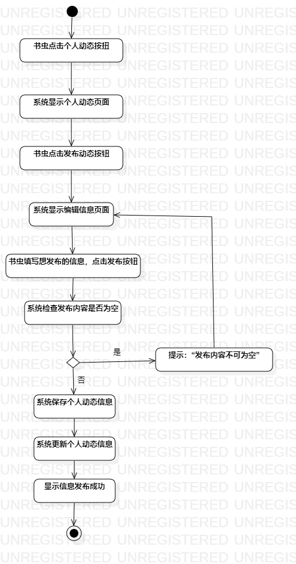
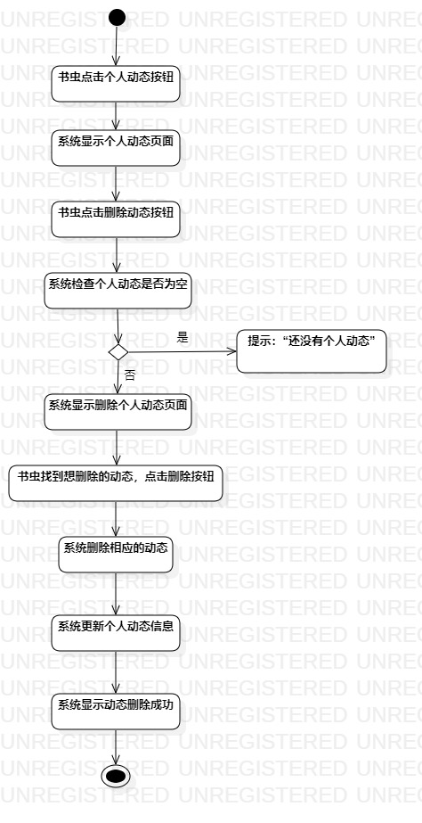
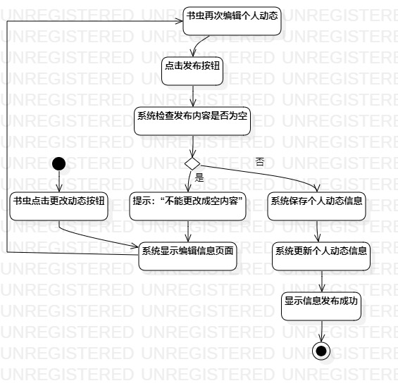

# 实验三：过程建模

## 一、实验目标
 
1、掌握过程建模方法  
2、掌握活动图的画法（Activity Diagram）  

## 二、实验内容

1、参照实验二写的用例规约画出活动图  
2、完成实验三的报告  

## 三、实验步骤

1、用Initial和Final代表开头与结尾  
2、参照实验二里面的用例规约的基本和扩展流程添加Action  
3、把各Action用Control flow连接  
4、思考流程和完善活动图  

## 四、实验结果

    
图1.发布动态的活动图

        
图2.删掉动态的活动图  

    
图3.再次编辑的活动图  
