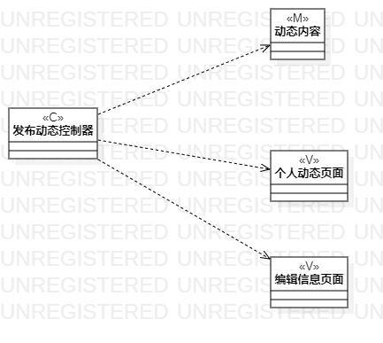
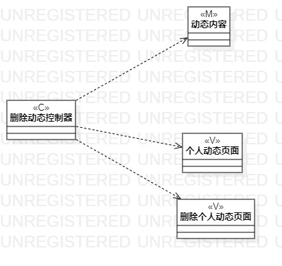
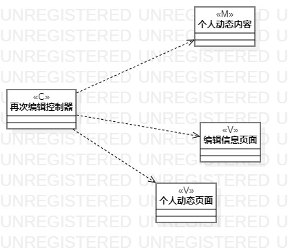

# 实验四和实验五：类建模与高级类建模

## 一、实验目标
 
1、掌握类建模方法  
2、了解MVC设计模式  
3、掌握类图的画法（Class Diagram）

## 二、实验内容

1、基于MVC模式设计类  
2、设计类的关系  
3、画出类图（发布动态的类图、删掉动态的类图、再次编辑的类图）

## 三、实验步骤

1、根据教学视频在实验2的用例规约上M、V、C三种类  
2、在StarUML中画出这些类  
3、根据MVC模式确定相应关系  
4、用正确的dependency关系箭头连线  
5、完成实验报告  

## 四、实验结果

      
图1.发布动态的类图 

      
图2.删掉动态的类图

    
图3.再次编辑的类图  

## 五、上课笔记内容

关于"取消"按钮问题，上个实验3图2，那个提示空内容的分支是没必要的，就像后来的视频说的空内容也是结果
