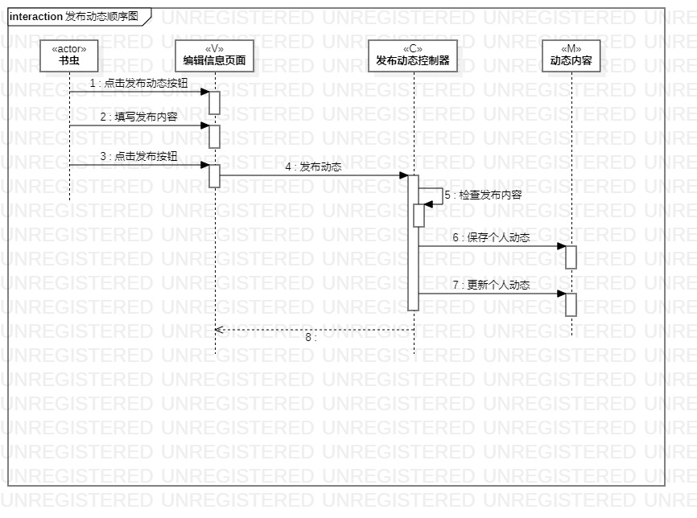
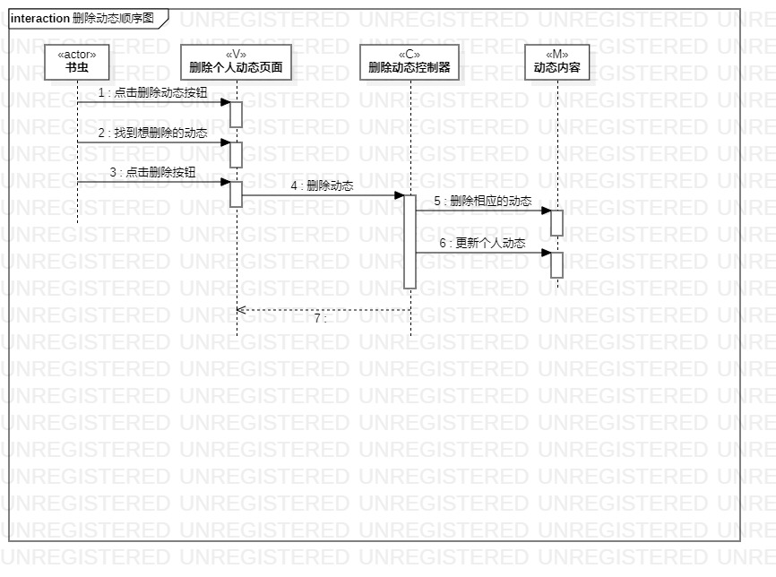
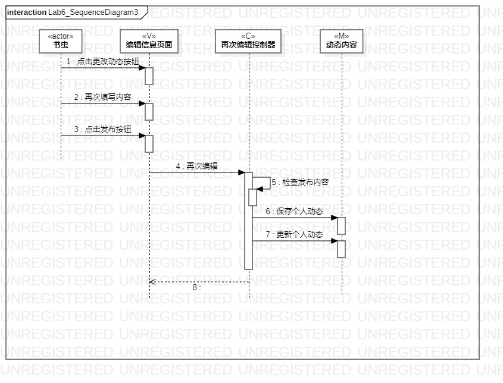

# 实验六：交互建模

## 一、实验目标

1、理解系统交互  
2、掌握UML顺序图的画法  
3、掌握对象交互的定义与建模方法  

## 二、实验内容

1、根据用例模型和类模型，确定功能所涉及的系统对象  
2、在顺序图上画出参与者（对象）  
3、在顺序图上画出消息（交互）  

## 三、实验步骤

1、了解对象交互建模及顺序图概念和涉及到的画法   
2、根据实验二、实验三、实验四五分别确认参与者、活动顺序、n+1个参与者  
3、创建三个顺序图项目（发布动态顺序图、删除动态顺序图、再次编辑顺序图）    
4、提交三张顺序图并编写实验报告  

## 四、实验结果

      
图1.发布动态的顺序图

      
图2.删掉动态的顺序图

    
图3.再次编辑的顺序图

## 五、上课笔记内容
1、不要画出2个实际上一模一样的类  
2、想想还有哪些忽略的类  
3、根据实验2345作图，并且把不需要的、错误的改掉  
