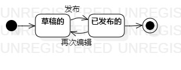

# 实验七：状态建模

## 一、实验目标

1、掌握对象状态建模（状态图，Statechart）   

## 二、实验内容

1、根据教学视频思考状态图  
2、修改之前的用例图、活动图、类图、顺序图并且画出状态图  
3、编写实验报告文档  

## 三、实验步骤

1、根据用例图、活动图、类图、顺序图找出关键对象：动态内容  
2、找出状态：草稿的、已发布的，并在StarUML画出状态图  
3、编写实验报告文档  

## 四、实验结果

        
图1.动态内容的状态图  

## 五、上课笔记内容
1、删除动态这一步因为是把内容全部删除而不是标记，所以没有画上来  
2、在选取对象时，要考虑对象是否还存在于系统中  
