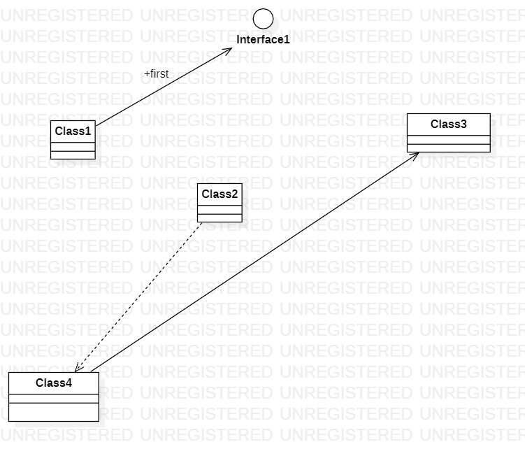

# 实验一

## 一、实验目标

1.熟悉和使用GitHub  
2.安装和使用StarUML  

## 二、实验内容

1.安装GitHub并练习使用Git Bash  
2.安装StarUML并画一个图  

## 三、实验步骤

1.  登录GitHub，熟悉GitHub的内容
2.  安装使用git，把GitHub的项目克隆下来
3.  创建markdown文件，使用git把本地创建的markdown文件上传到GitHub上
4.  使用starUML画图，并把图片上传到GitHub上
5.  把所有文件上传到GitHub上，检查是否已经上传到GitHub上，确认无误后点击pull request提交请求

## 四、实验结果

1.画图  
  
图1.在StarUML上创建的第一个图
