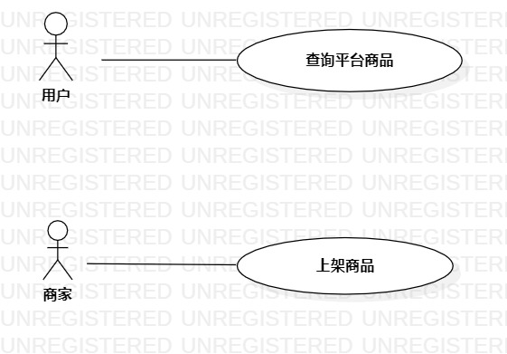

# 实验二：用例建模

## 一、实验目标

1.使用Markdown修改实验一报告  
2.选题并进行用例建模

## 二、实验内容

1.在GitHub使用Markdown修改实验一报告  
2.确定选题  
3.在StarUML中画建模用例图  
4.编写用例规范

## 三、实验步骤

1. 修改实验一报告
2. 确定选题  
3. 根据确定的选题画建模用例图
4. 编写完善用例规范

## 四、实验结果

图1.在StarUML画的SNKRS购物平台系统用例图

## 表1：查询用例规约  

用例编号  | UC01 | 备注  
-|:-|-  
用例名称  | 查询平台商品  |   
前置条件  |      | *可选*   
后置条件  |  用户进入商品页面    | *可选*   
基本流程  | 1. 用户进入SNKRS购物平台首页；  |*用例执行成功的步骤*    
~| 2. 用户点击搜索框，输入商品关键字，点击搜索；  | 
~| 3. 系统检查搜索框内容不为空；  |  
~| 4. 系统根据搜索关键字查询商品信息；  |   
~| 5. 系统显示查找得到的相关商品；   |   
扩展流程  | 3.1 系统检查搜索框为空，提示“商品名称不能为空”；  |*用例执行失败*     

## 表2：商家发售商品用例规约  

用例编号  | UC02 | 备注  
-|:-|-  
用例名称  | 上架商品  |   
前置条件  |      | *可选*   
后置条件  |      | *可选*   
基本流程  | 1. 商家进入SNKRS商品发售页面；  |*用例执行成功的步骤*    
~| 2. 商家填写商品信息，点击发售按钮；  |   
~| 3. 系统检测商品信息填写完善； | 
~| 4. 系统保存商品信息； | 
~| 5. 系统显示商品发售成功。 |
扩展流程  | 3.1 商品信息填写不完善，提示＂商品信息填写不完善＂。  |*用例执行失败*    

