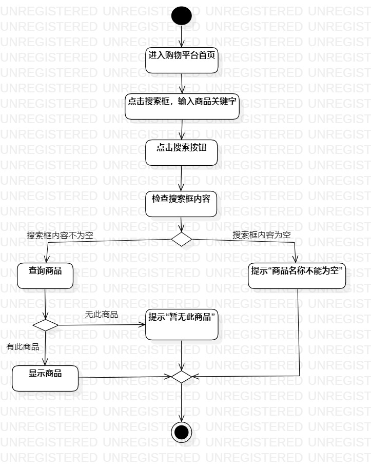

# 实验三：过程建模

## 一、实验目标
1. 掌握过程建模方法
2. 掌握活动图的画法（Activity Diagram）

## 二、实验内容
1. 根据用例画出活动图

## 三、实验步骤
1. 熟悉活动图的各个组成，如Initial、Final、Action、Decision等部件
2. 打开实验二报告
3. 根据实验二用例规约去画活动图

## 四、实验结果

  
图1.查询平台商品的活动图

  
图2.上架商品的活动图
