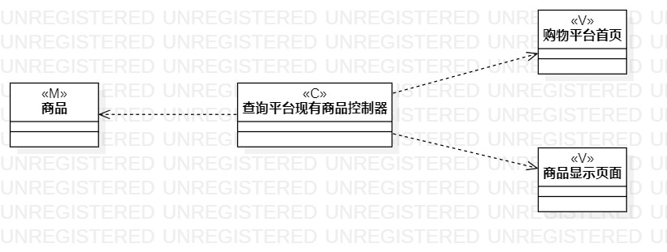
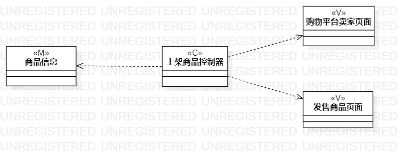

# 实验四：类建模

## 一、实验目标
1. 掌握类建模方法
2. 了解MVC或熟悉的设计模式
3. 掌握类图的画法（Class Diagram）
4. 理解类的5种关系

## 二、实验内容
1. 根据用例规约创建类图

## 三、实验步骤
1. 了解MVC设计模式
2. 根据MVC设计模式创建“查询平台商品”用例类图
3. 根据MVC设计模式创建“上架商品”用例类图

## 四、实验结果
  
图1.查询平台商品用例的类图

  
图2.上架商品用例的类图
