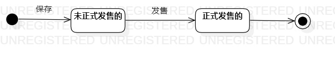

# 实验七：状态建模

## 一、实验目标
1. 掌握对象的状态建模（Statechart）

## 二、实验内容
1. 确定一个对象，画出状态图
2. 编写实验报告文档

## 三、实验步骤
1. 先观看教学视频，学习什么是状态图
2. 根据用例图、活动图、类图、顺序图找出关键对象————商品
3. 根据对象的每一种状态画出状态图
4. 编写实验文档

## 四、实验结果
  
图1.商品的状态图
