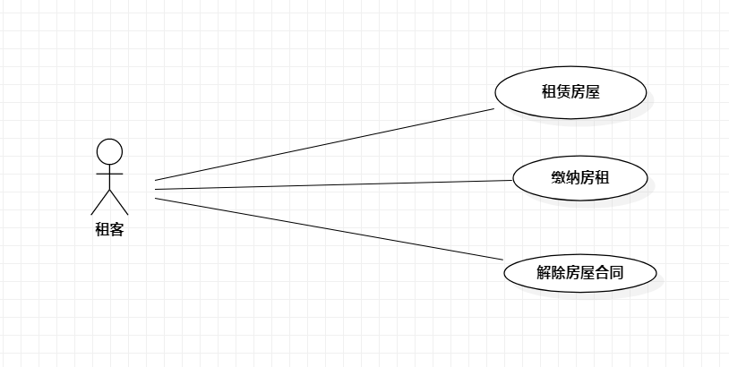

# 实验二：用例建模

## 一、实验目的

1. 学会使用Markdown编写报告
2. 了解用例的概念
3. 学习使用StarUML用例建模

## 二、实验内容  

1. 确定选题
2. 画用例图
3. 编写实验报告
4. 编写用例规约

## 三、实验步骤  

1. 确定选题为房屋租赁管理系统
2. 在StarUML上创建用例图
3. 确定参与者（Actor）
   - 租客
4. 确定用例（UseCase）
   - 租赁房屋
   - 缴纳租金
   - 解除房屋合同
5. 建立Actor和UserCase之间的联系
6. 编写用例规约

## 四、实验结果  

1. 画图  
  
图1:房屋租赁管理系统的用例图

## 表1：租赁房屋用例规约  

用例编号  | UC01 | 备注  
-|:-|-  
用例名称  | 租赁房屋  |   
前置条件  | 租户登陆进入房屋租赁管理系统   | *可选*   
后置条件  |      | *可选*   
基本流程  | 1. 租户进入房屋信息页面；  |*用例执行成功的步骤*    
~| 2. 系统显示房屋信息页面；  |   
~| 3. 租户选择房屋点击确认租赁；  |
~| 4. 系统收到指令显示租赁确认界面；  |
~| 5. 租户支付押金；  |
~| 6. 系统检测已支付，显示"租赁成功"；  |
~| 7. 系统将该房屋信息从页面上移除

扩展流程  | 6.1  没有成功支付，系统提示"租赁失败"。 |*用例执行失败*   

## 表2：缴纳租金用例规约  

用例编号  | UC02 | 备注  
-|:-|-  
用例名称  | 缴纳租金  |   
前置条件  | 租客租赁房屋成功  | *可选*   
后置条件  |    | *可选*   
基本流程  | 1. 租户选择已租赁房屋和租赁时间；  |*用例执行成功的步骤*    
~| 2. 系统收到指令计算并相应的房屋租金；  |   
~| 3. 系统显示相应的租金确认界面  |   
~| 4. 租客点击确认缴纳；  |
~| 5. 系统检测用户数是否支付；  |
~| 6. 成功支付，系统提示"支付成功"。

扩展流程  | 6.1  没有成功支付，系统提示"支付失败"。 |*用例执行失败*   

## 表3：解除房屋租赁合同用例规约  

用例编号  | UC03 | 备注  
-|:-|-  
用例名称  | 解除房屋租赁合同  |   
前置条件  | 租客登录进入房屋租赁管理系统  | *可选*   
后置条件  | | *可选*   
基本流程  | 1. 租户进入自己已经租赁的房屋的页面；  |  
~| 2. 系统显示该租客的租赁信息；  |   
~| 3. 租户选择要解除租赁合同的房屋；  |   
~| 4. 系统收到租户指令并检测用户的房屋租金缴纳状态；  |
~| 5. 系统检测租户已缴清租金，显示"解除成功"，并将押金退回给租户。   |*用例执行成功的步骤*  
~| 6. 系统将该房屋信息重新上传到房屋信息页面。
扩展流程  | 4.1 系统检测发现该用户未缴纳完租金，系统显示"解除失败"，租赁状态保持不变。 |*用例执行失败*    

