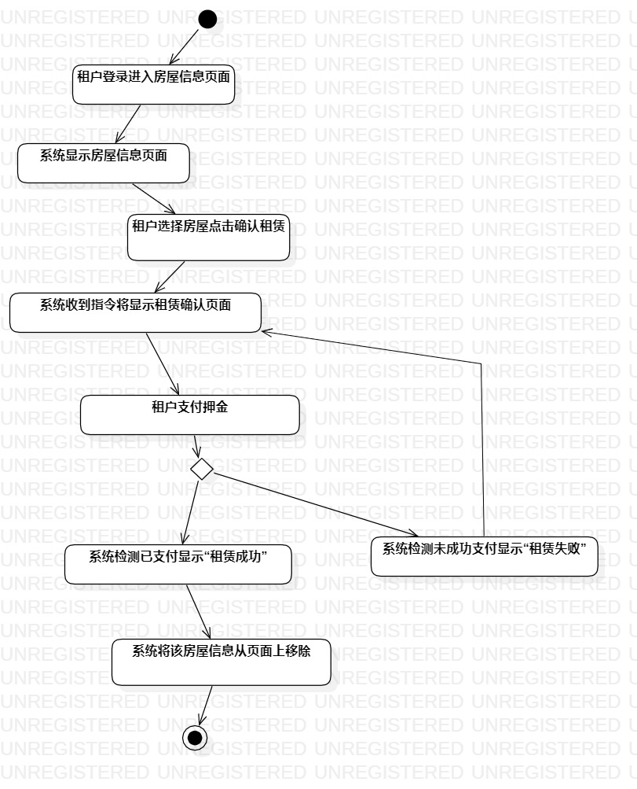
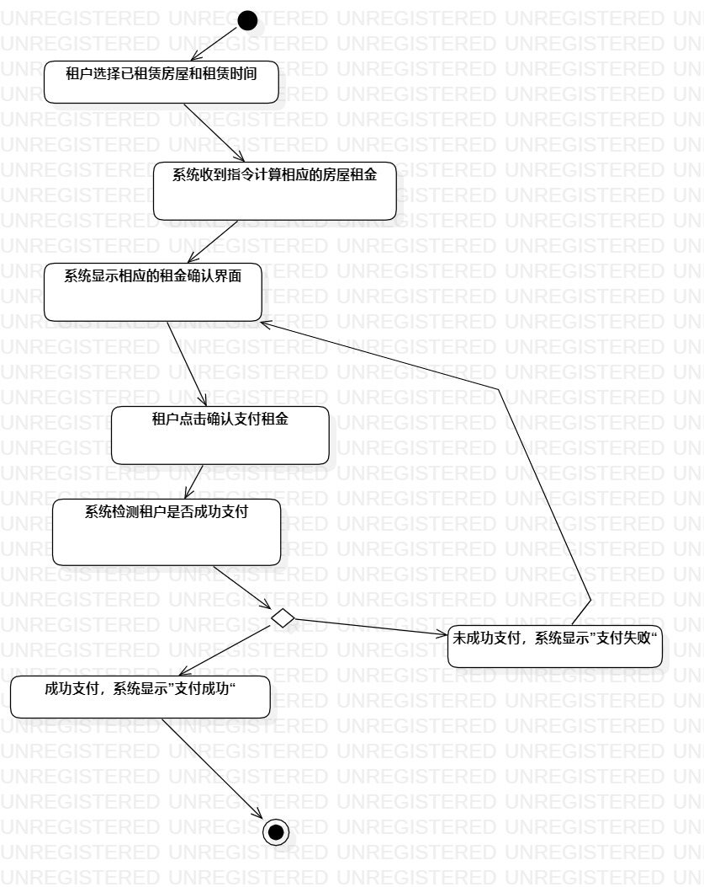
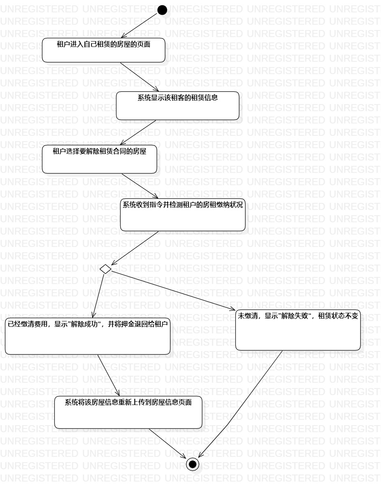

# 实验3：过程建模 
## 一、实验目标
1.掌握过程建模方法。  
2.掌握活动图的画法。（Activity Diagram）
## 二、实验步骤
->1.创建Activity Diagram  
->2.添加初始结点和结束结点  
->3.添加活动
->4.分支处添加决策  
->5.添加流程线
->6.调整整体  
## 三、画图要点
1.把基本流程和扩展流程的动作画为操作（Action）。  
2.在出现分支的操作之后使用决策（Decision）节点。
## 四、实验结果
用例一：租赁房屋 
  
用例二：缴纳租金 
  
用例三：解除房屋合同  

