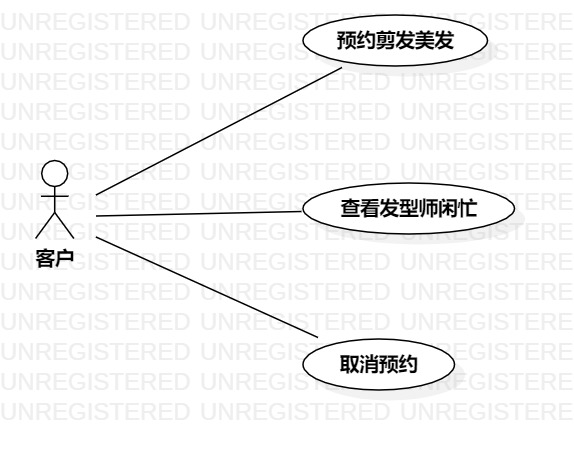

# 实验二：用例建模

 ## 1.实验目标
    1.确定选题
    2.根据选题确定功能
    3.画出选题用例图
    4.完成用户规约
 ## 2.实验内容
    1.确定并画出用例与参与者的用例图
    2.制作用户规约
 ## 3.实验步骤
    1.提交选题
    2.确定参与者——剪发用户
    3.确定系统三个功能
       1）患者就诊挂号  
       2）填写并提交生病基本信息  
       3）选择就诊科室
    4.建立参与者与用例之间的联系
    5.写出三个用例的用例规约
 ## 4.实验结果

图一美发剪发预约系统用例图

# 用例规约的编写

## 表1：查看发型师闲忙用例1规约  

 用例编号  | UC01 | 备注  
 -|:-|-  
 用例名称  | 查看发型师闲忙 |   
 前置条件  |     登录      | *可选*   
 后置条件  |           | *可选*   
 基本流程 | 1.用户点击查看发型师；  |
 ~| 2.系统显示查询页面； | 
 ~| 3.用户输入发型师姓名或编号；  | 
 ~| 4.系统检查输入内容，查询发型师信息，读取发型师信息以及排队人数并显示；  |    
 ~| 5.用户点击查看发型师详情；   |   
 ~| 6.系统显示发型师的评价与价格；   |   
 扩展流程  | 4.1系统检查输入内容为空，提示“输入内容不能为空” |
 ~|4.2系统检查发型师信息不存在，提示“不存在此发型师” | 

 ## 表2：预约剪发美发用例2规约  

 用例编号  | UC02 | 备注  
 -|:-|-  
 用例名称  | 预约美发剪发 |   
 前置条件  |  用户进入查看发型师页面 | *可选*   
 后置条件  |     | *可选*   
 基本流程  | 1.用户点击预约按钮；|  *用例执行成功的步骤*     
 ~| 2.系统显示预约套餐选择页面；|
 ~| 3.用户选择剪发美发服务的套餐，点击确定；|
 ~| 4.系统检查排队人数未达上限以及发型师没有休息；|
 ~| 5.系统保存预约订单；|
 ~| 6.系统显示成功预约页面，并返回首页；| 
 扩展流程  | 4.1排队人数已达上限，系统显示“人数已达上限”；| 
 ~| 4.2预约的时间发型师休息，系统显示“发型师休息”；|  
 
## 表3：取消预约用例3规约  

 用例编号  | UC03 | 备注  
 -|:-|-  
 用例名称  | 取消预约  |   
 前置条件  |   成功预约剪发  | *可选*   
 后置条件  |      | *可选*   
 基本流程  | 1.用户点击我的预约； |*用例执行成功的步骤*    
 ~| 2.系统查看是否有预约；|   
 ~| 3.系统显示已预约的订单；|   
 ~| 4.用户点击取消预约按钮；|   
 ~| 5.系统删除预约订单；|  
 ~| 6.系统显示成功取消预约；|   
 扩展流程  |2.1 用户没有预约，系统显示“没预约订单”|*用例执行失败*    

