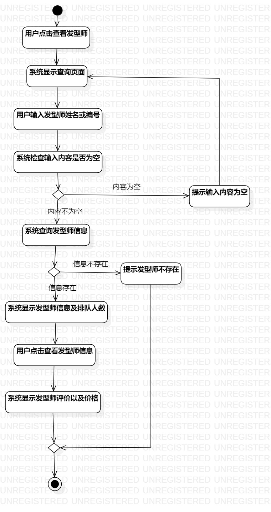
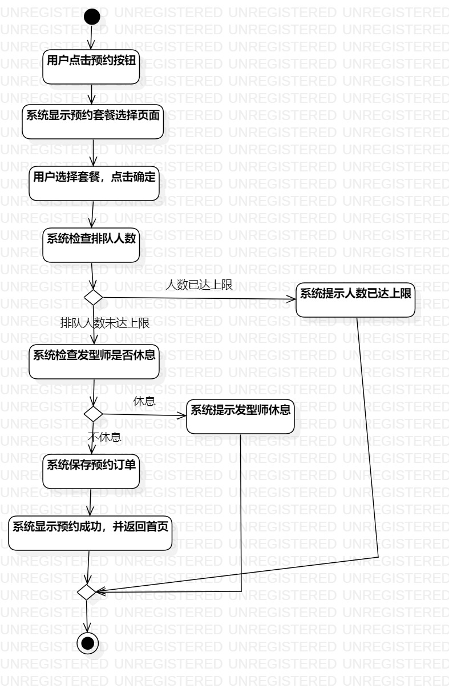
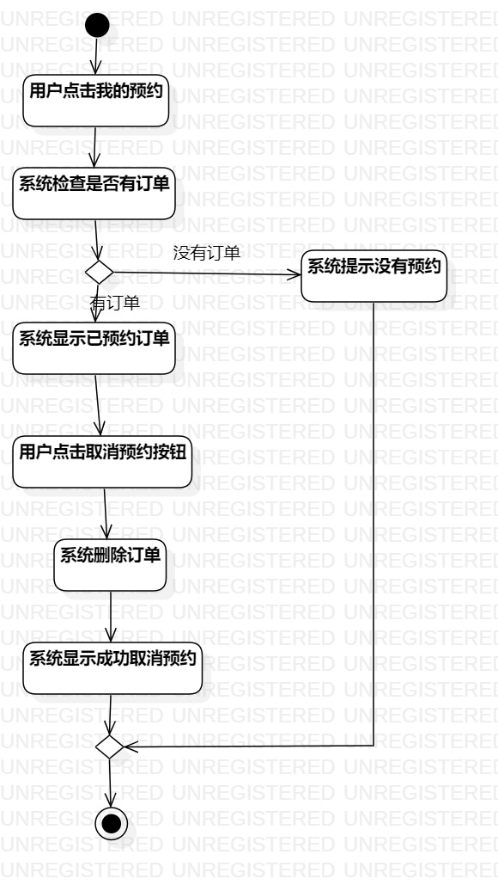

## 1.实验目的
 1.掌握过程建模方法。
 2.掌握活动图的画法。

 ## 2.实验内容
 1. 查看剪发美发预约系统的用例规约
 2. 画出用例的活动图

 ## 3.实验步骤
 1. 查看剪发美发预约系统用例规约
 2. 画出查看发型师闲忙活动图
 3. 画出预约剪发美发活动图
 4. 画出取消预约活动图
 ## 4.实验结果
 
 
 图一：查看发型师闲忙活动图

 
 
 图二：预约剪发美发活动图

 
 
 图三：取消预约活动图
