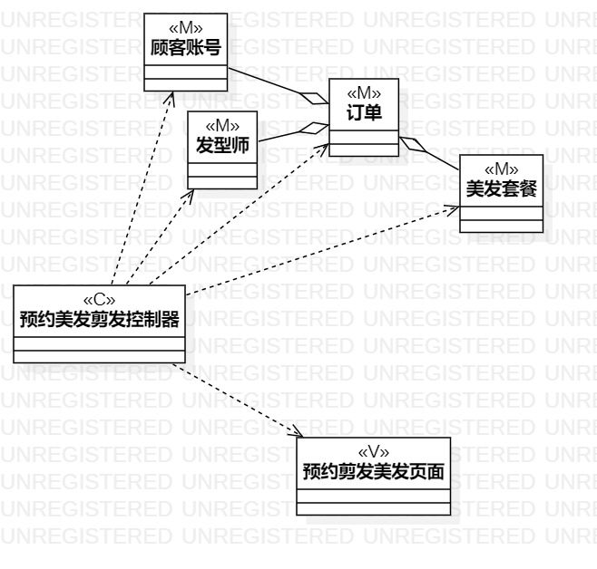

 ## 1.实验目的
 1.掌握类建模方法
 
 2.了解MVC的设计模式
 
 3.掌握类图的画法（Class Diagram）

 ## 2.实验内容
 1. 查看剪发美发预约系统的用例规约
 2. 画出三个用例的类图

 ## 3.实验步骤
 1. 查看剪发美发预约系统用例规约
 2. 画出查看发型师闲忙类图
 3. 画出预约剪发美发类图
 4. 画出取消预约类图
 ## 4.实验结果
 
 
 图一：查看发型师闲忙类图

 
 
 图二：预约剪发美发类图

 
 
 图三：取消预约类图
