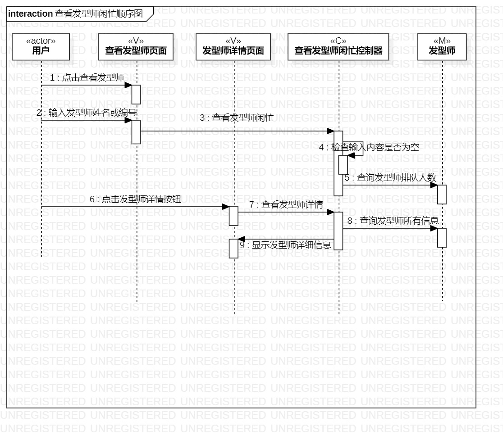
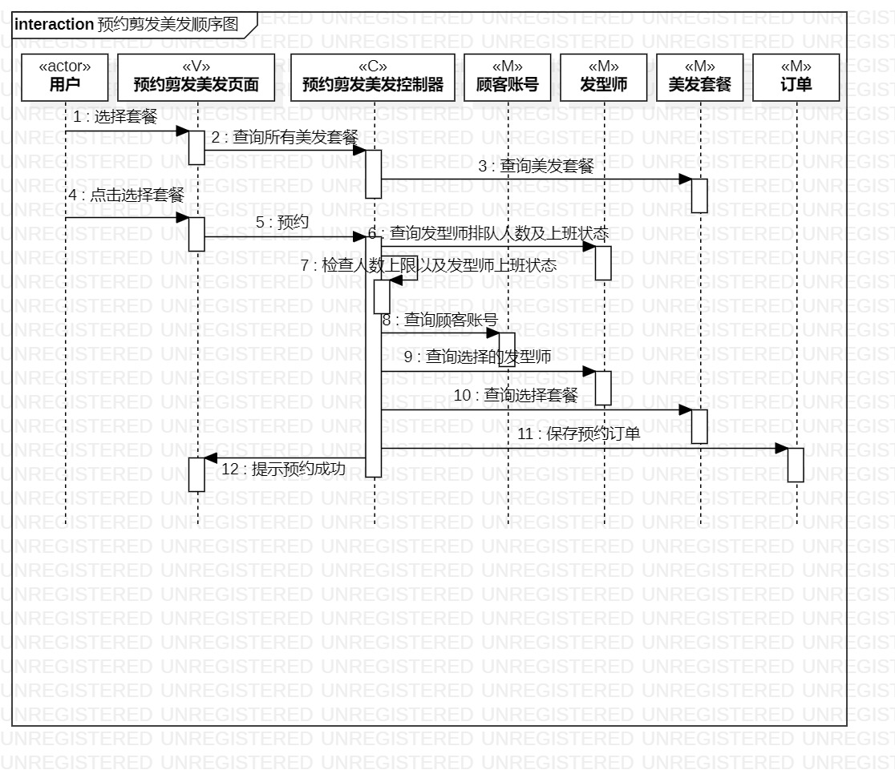
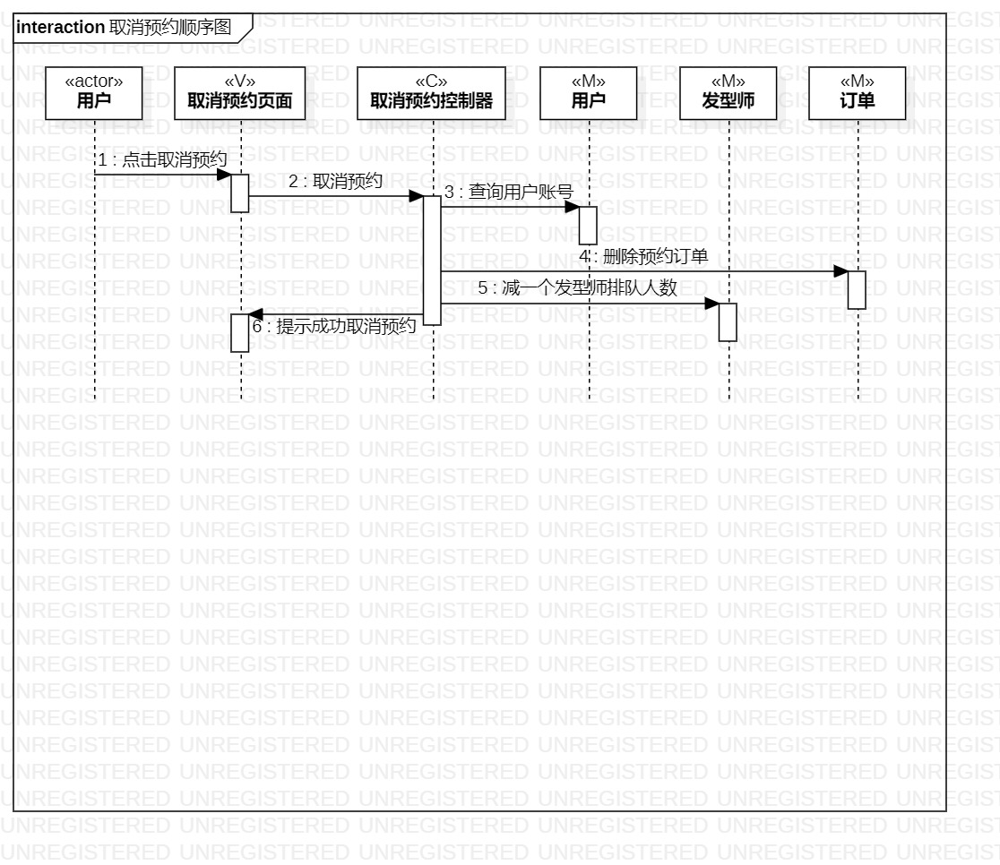

 ## 1.实验目的
 1.理解系统交互；
 
 2.掌握UML顺序图的画法；
 
 3.掌握对象交互的定义与建模方法。

 ## 2.实验内容
 1.根据用例模型和类模型，确定功能所涉及的系统对象；
 
 2.在顺序图上画出参与者（对象）；
 
 3.在顺序图上画出消息（交互）。

 ## 3.实验步骤
 1. 查看剪发美发预约系统的类图，找出每个用例参与者
 2. 查看剪发美发预约系统的活动图
 3. 根据活动图画出各个用例的顺序图
 ## 4.实验结果
 
 
 图一：查看发型师闲忙顺序图

 
 
 图二：预约剪发美发顺序图

 
 
 图三：取消预约顺序图
