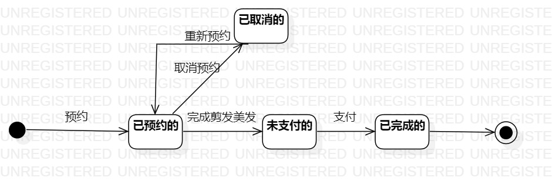

 ## 1.实验目的
 1.理解状态建模；
 
 2.掌握UML状态图的画法；
 
 3.掌握状态之间的转变。

 ## 2.实验内容
 1.找出剪发美发预约系统中最重要的对象；
 
 2.在状态图上画出对象的所有状态；
 
 3.在状态图上画出状态之间的转变以及转变的条件。

 ## 3.实验步骤
 1. 找出系统中最重要的对象——订单
 2. 在状态图上画出对象的四个状态：
    1.已预约的
    2.已取消的
    3.未支付的
    4.已完成的
 3. 根据活动图画出状态间的转变以及转变的条件
 ## 4.实验结果
 
 
 图一：订单的状态图
