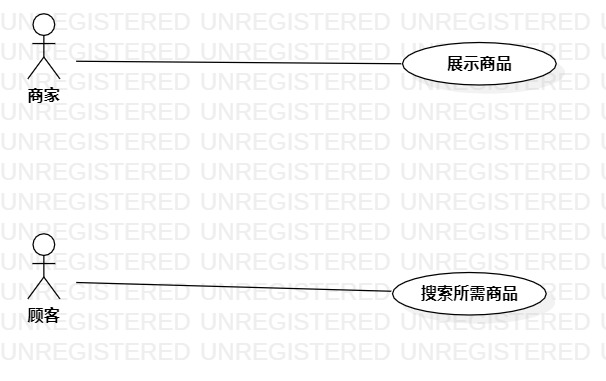

# 实验二：用例建模

## 1. 实验目标
1. 学会用Markdown编写实验报告
2. 确定个人建模选题
3. 掌握UML和用例的概念
4. 学会用StarUML画例图

## 2. 实验内容
1. 提交个人建模选题到Issues中
2. 学习UML和用例的概念
3. 运用StarUML画例图

## 3. 实验步骤
1. 确定个人建模选题为商品导购系统
2. 使用StarUML画出商品导购系统例图
3. 将商品导购系统例图保存并上传到GitHub

## 4. 实验结果

图1:商品导购系统的用例图

## 表1：展示商品用例规约  

用例编号  | UC01 | 备注  
-|:-|-  
用例名称  | 展示商品  |   
前置条件  |     |    
后置条件  |     |    
基本流程  | 1. 商家点击添加商品链接  |    
~| 2. 系统显示添加页面 |   
~| 3. 商家输入商品的名称、价格、图片和购买链接，点击添加按钮 |   
~| 4. 系统检查商品信息完整，链接为有效  |   
~| 5. 系统保存商品信息，显示添加成功 |  
扩展流程  | 4.1  系统发现商品信息不完整，提示请输入完整商品信息 |   
~| 4.2  系统检查发现链接为无效链接，提示请输入正确的链接 |

### 表2：搜索所需商品用例规约  

用例编号  | UC02 | 备注  
-|:-|-  
用例名称  | 搜索所需商品  |   
前置条件  |    |  
后置条件  |     |  
基本流程  | 1. 顾客点击搜索商品链接；  |
~| 2. 系统显示搜索界面；  |   
~| 3. 顾客输入所需商品名称点击搜索按钮；   |   
~| 4. 系统检查商品名称不为空白，打开对应商品界面；   |   
扩展流程  | 4.1 系统检查商品名称为空白，显示请输入商品名称。  |   
