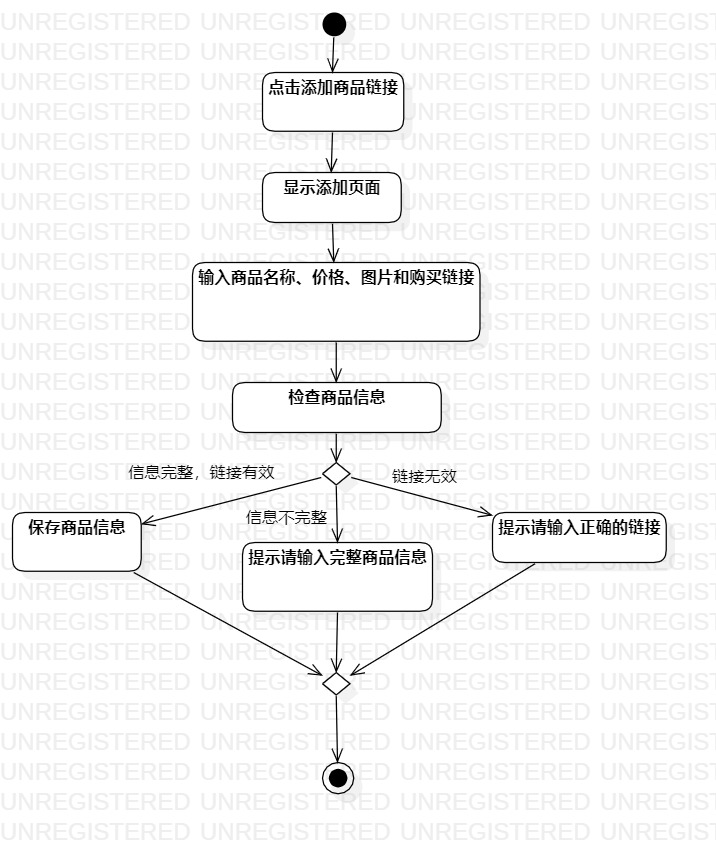
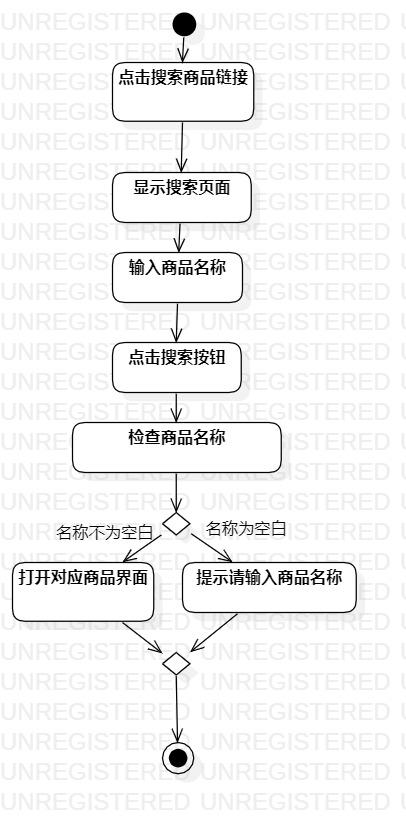

# 实验三：过程建模

## 一、实验目标

1. 掌握过程建模方法
2. 掌握活动图的画法

## 二、实验内容

1.观看实验相关视频和阅读实验文档；

2.回顾实验二用例规约的流程；

3.用StarUML绘制活动图；

4.编写实验报告。

## 三、实验步骤

1.在StarUML新建两个ActivityDiagram：

（1）展示商品；

（2）搜索所需商品。

2.根据实验二用例规约绘图：

（1）新建Initial结点和Final结点；

（2）绘制动作和决策图形来表示整个基本流程和扩展流程。

3.检查活动图与用例规约的流程一致。

## 实验结果

  
图1：展示商品的活动图

  
图2：搜索所需商品的活动图

