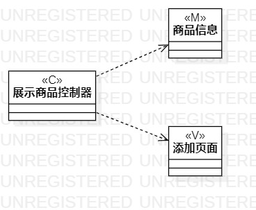
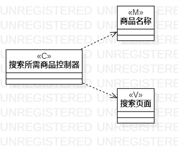

# 实验四类建模
# 实验五高级类建模

## 一. 实验目标
1. 了解类图概念
2. 了解MVC模式
3. 掌握类图画法
4. 了解UML类图的5种关系
5. 掌握类建模方法

##二. 实验内容
1. 学习类图概念
   - 类与类
   - 类与关系
2. 学习类图画法
3. 根据选取用例和用例规约画出类图

## 三. 实验步骤
1. 根据MVC模式观察用例的模式（数据）、视图、控制器（系统）
2. 打开StarUML model新建Class diagram
3. 根据用来规约来画出展示商品的类图
4. 根据用来规约来画出搜索所需商品的类图
5. 将画出的类图git push到个人库
6. 书写lab4.mb实验报告

## 四. 实验结果

图1：展示商品类图

图2：搜索所需商品类图
