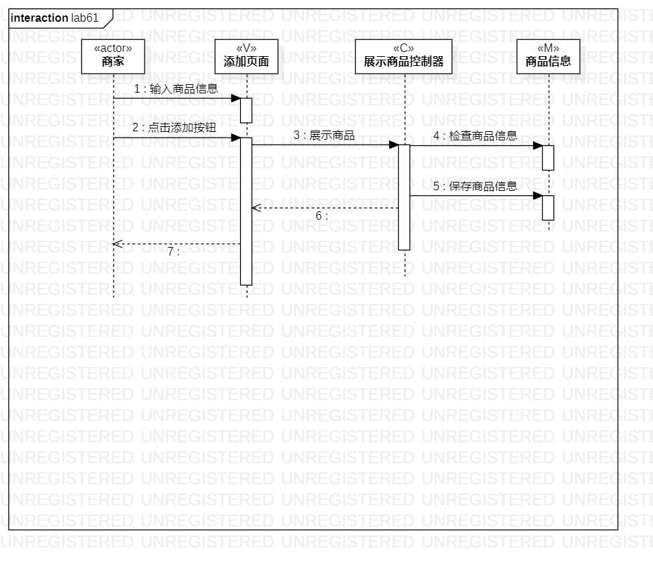
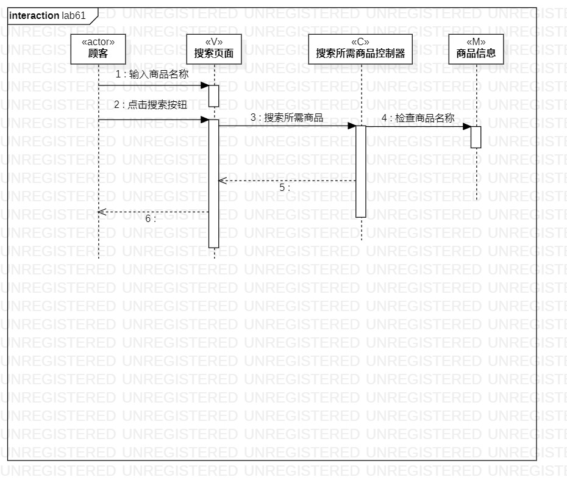

# 实验六：交互建模

## 实验目标

1.  理解系统交互；
2.  掌握UML顺序图的画法；
3.  掌握对象交互的定义与建模方法。

## 实验内容

1.  根据用例模型和类模型，确定功能所涉及的系统对象；
2.  在顺序图上画出参与者（对象）；
3.  在顺序图上画出消息（交互）。

## 实验步骤

1. 新建顺序图Sequence diagram
2. 打开之前的类图、活动图、用例规约
3. 根据类图确定参与者
4. 根据活动图、用例规约画出参与者之间的消息
5. 分别画出展示商品和搜索所需商品的顺序图
6. 书写lab6.md实验报告

## 实验结果

  
图1：展示商品的顺序图

  
图2：搜索所需商品的顺序图
