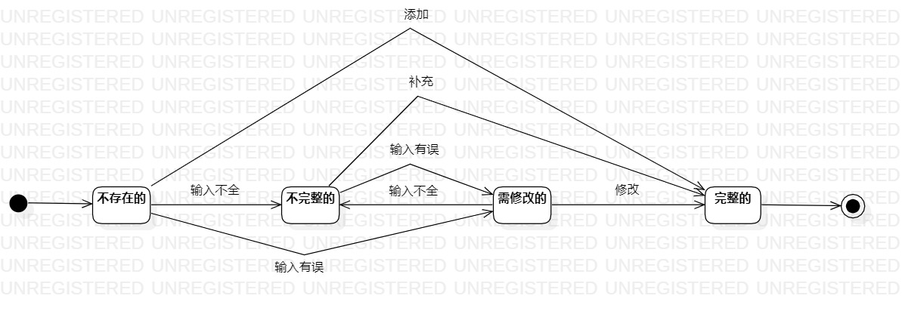

# 实验七：状态建模

## 实验目标

1.掌握对象状态建模方法

2.画出状态图

## 实验内容

1.根据用例图、用例规约、活动图等，确定关键对象

2.确定对象的状态和状态间转换的条件

2.画出状态图

## 实验步骤

1.新建状态图；

2.根据前面需求，确定状态图对象为商品信息；

2.确定商品信息的所有状态；

3.确定商品信息状态转变的条件；

4.绘制商品信息状态图

## 实验结果

商品信息的状态图

