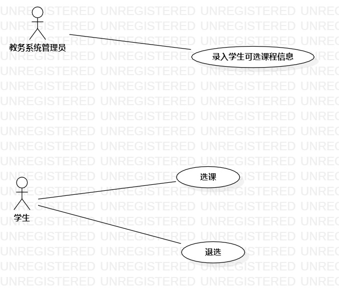

# 实验二 用例建模
## 一、实验目标
### 1.掌握用例概念确定用例
### 2.用StarUML画出用例图
## 二、实验内容
### 1.确定选题及说明功能
### 2.画出选题的用例图
### 3.使用用例规约说明用例
## 三、实验步骤
### 1.在lessues发布自己的选题：学生选课系统
### 2.根据选题确认参与者：学生和教务系统管理员；用例：录入课程信息、选课和退选
### 3.用StarUML画出学生选课系统用例图
### 4.编写实验报告
## 四、实验结果

## 五、用例规约的编写
 ### 表1：录入课程信息用例规约  

 用例编号  | UC01 | 备注  
-|:-|-  
用例名称  | 录入课程信息  |   
前置条件  | 教务系统管理员登录     | *可选*   
后置条件  |      | *可选*   
基本流程  | 1. 教务系统管理员点击课程录入按钮；  |*用例执行成功的步骤*    
~| 2. 进入管理员管理页面；  |   
~| 3. 教务系统管理员按要求输入课程信息；   |   
~| 4. 教务系统管理员点击提交；   |   
~| 5. 系统检测课程信息格式无误，保存课程信息，提示录入成功；   |
~| 6. 系统自动跳转回主菜单界面。  |
扩展流程  | 5.1 系统检测输入内容为空，提示课程信息不能为空，重新输入。  |*用例执行失败*
~| 5.2  发现录入课程信息格式有误，重新输入；   |

### 表2：选课用例规约
用例编号  | UC02 | 备注  
-|:-|-  
用例名称  | 选课  |   
前置条件  | 学生登录     | *可选*   
后置条件  |      | *可选*   
基本流程  | 1. 学生点击选课按钮；  |*用例执行成功的步骤*    
~| 2. 系统检测跳转可选课程的页面；  |           
~| 3. 学生选择心仪的课程；   |   
~| 4. 学生选择后点击提交；   |   
~| 5. 系统检测选课学生未满，已选课的人数+1，保存选课信息，提示“提交成功”；   |
扩展流程  | 5.1 系统检测可选学生已满，提示“人数已满”；  |*用例执行失败* 

### 表3：退选用例规约
用例编号  | UC02 | 备注  
-|:-|-  
用例名称  | 退选  |   
前置条件  | 学生已选课     | *可选*   
后置条件  |      | *可选*   
基本流程  | 1. 学生点击退选按钮；  |*用例执行成功的步骤*    
~| 2. 系统检测跳转退选的页面；  |           
~| 3. 学生选择不喜欢的课程；   |   
~| 4. 学生选择后点击提交；   |   
~| 5. 系统删除选课信息（之前选课时创建的），修改该课程的已选人数，保存退选信息，提示“退选成功”；   |
扩展流程  | 3.1 学生还没选课，不存在不喜欢的课程  |*用例执行失败* 

