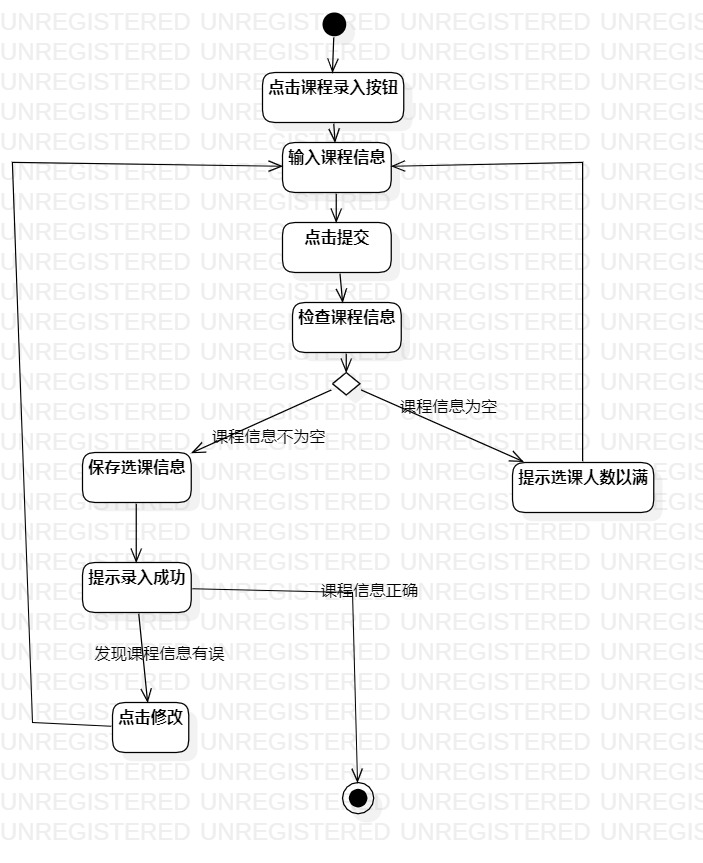
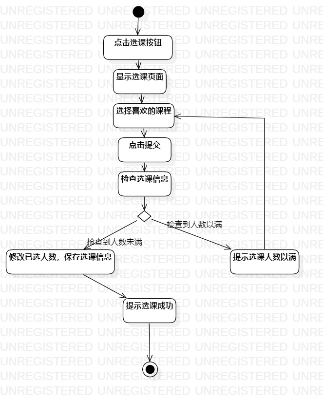
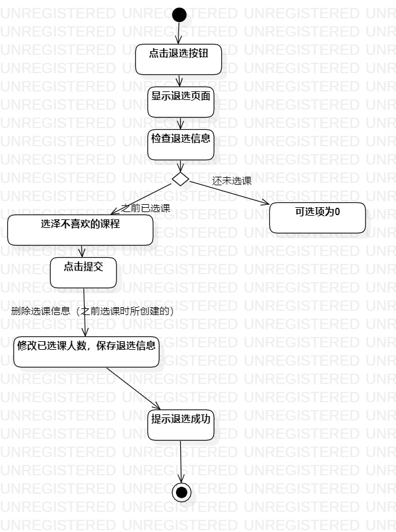

# 实验三：过程建模

## 一、实验目标

1. 掌握过程建模方法
2. 掌握活动图的画法（Activity Diagram）

## 二、实验内容

1. 根据实验二中的用例规约创建活动图

## 三、实验步骤

1. 创建 录入课程信息，选课和退选 的活动图
2. 添加initial和final
3. 根据用例规约添加action
4. 在扩展流程的部分添加decision
5. 最后用control flow连接起来
6. 调整图标的位置使连线不交叉，并尽可能简洁美观

## 实验结果

  
图1：录入课程信息的活动图    
  
图2：选课的活动图
  
图3：退选的活动图
